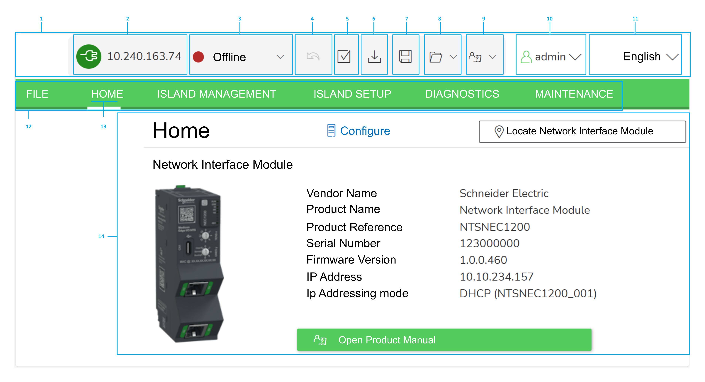

# User Interface

| Number | Description |
| --- | --- |
| 1 | State bar |
| 2 | Connected /  Disconnected icon and IP address |
| 3 | Online/Offline or synchronized/not synchronized status |
| 4 | Undo button |
| 5 | [Build button](BuildButton-F6FE3CAC.html) |
| 6 | [Download Configuration to NIM button](DownloadConfigurationToNetworkInter-F6FE44CA.html) |
| 7 | [Save button](SaveTheConfigurationToDiskButton-F6FE4B74.html) |
| 8 | Manage the Configuration, quick access menu to the following buttons:  * [Open Configuration from NIM](OpenTheConfigurationFromTheHead-07890485.html) * [Scan & Create Configuration](ScanCreateConfiguration-07891E63.html) * [Create a new Configuration](CreateANewConfiguration-07889C16.html) * [Open an existing Configuration from Disk](OpenAnExistingConfigurationFromDisk-07893DAE.html) * [Download Configuration to NIM](DownloadConfigurationToNetworkInter-F6FE44CA.html) * [Save the Configuration to Disk](SaveTheConfigurationToDiskButton-F6FE4B74.html) * [Help me choose what to do now](HelpMeChooseWhatToDoNow-078962EE.html) * [Build button](BuildButton-F6FE3CAC.html) * Undo button |
| 9 | Help button, quick access menu to the following buttons:   * Help me choose what to do now: Opens the Help. * About: Provides information about the software. |
| 10 | Connected user, click  to access log out button |
| 11 | Language menu, click  to select a different language.  NOTE: Changing the language does not require a restart. |
| 12 | Tabs ribbon, click a tab to display a page. |
| 13 | Tab of the displayed page |
| 14 | Home page |

EIO0000004810.01