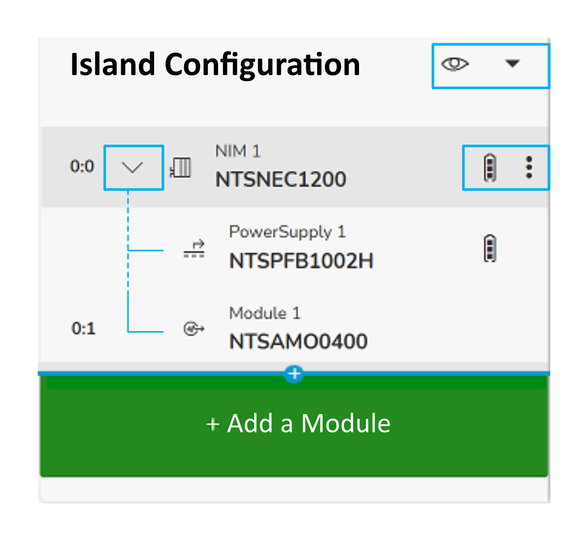

# Island Configuration

The following actions are available from the tree view:

| Button | Description | |
| --- | --- | --- |
|  | Displays the dimensions (width and height) of the island, clusters, and modules. | |
|  | Expands the structure below the modules.  NOTE: If the device mode parameter value is virtual reserved, the module appears dimmed . | |
|  | Power Consumption: displays the Power Consumption window (also accessible by clicking the icon ).  The Power Consumption window displays the following information for each power segment:   * Power segment name * Current available (in mA) * Current consumed (in mA) * Current consumption (in percents) * List of modules included in each segment with their individual current consumption (in mA)   For more information about the power distribution in your Modicon Edge I/O island, refer to the  [Modicon Edge I/O - System Planning and Installation Guide](../../../../../api/crossBook?lang=en-US&virtualBookName=EdgeIO_Spig&topicID=ModiconEdgeIONTSPowerDistribution_24CF3A22). | |
| Remove: allows you to delete a module from the configuration. | |
| Copy: allows you to copy a module from the configuration. | |
| Cut: allows you to cut a module from the configuration. | |
| Paste: allows you to paste a module in the configuration. | |
| Export as EDS: allows you to save the EDS file when the network interface module is configured as EtherNet/IP. | |
| Export as CSV: allows you to download the memory mapping as a `.csv` file. | |
| Export node list: allows you to save the OPC UA node list file. For more information, refer to [Node List File Description](NodeListFileDescription-0965EEFC.html#NodeListFileDescription-0965EEFC). | |
| Add a Module | Allows you to add a module. For more information, refer to [Island Configuration > Add a Module](IslandConfiguration-166B9DD5.html).  NOTE: You can click the plus sign (+) to insert a module between modules. | |
| Drag and drop | You can change the order of your module by dragging and dropping it in the tree view. | |

EIO0000004810.01