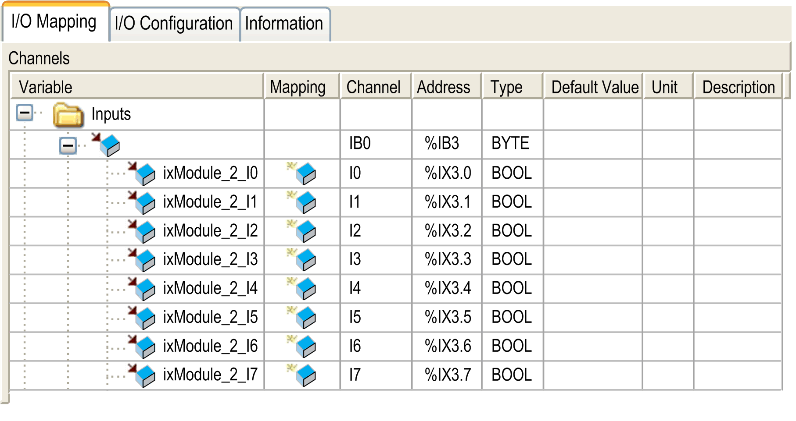

# I/O Mapping Tab

I/O Mapping Tab

This table identifies the addresses of each input and the channel name.

| Channel | Type | Description |
| --- | --- | --- |
| IB0 | BYTE | State of all inputs |
| I0 | BOOL | State of input 0 |
| ... | ... |
| I7 | State of input 7 |

For further generic descriptions, refer to [I/O Mapping Tab Description](../M238_OH_-_IO_General_Precautions/M238_OH_-_IO_General_Precautions-4.htm#XREF_D_SE_0006553_6).