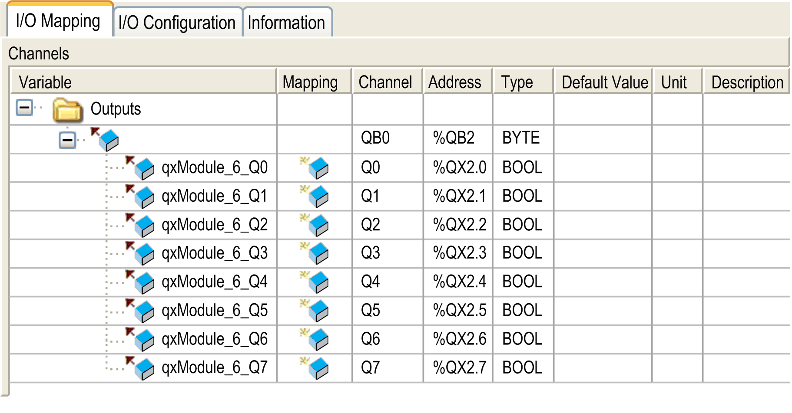

# I/O Mapping Tab

I/O Mapping Tab

This table identifies the addresses of each output and the channel name.

| Channel | Type | Default Value | Description |
| --- | --- | --- | --- |
| QB0 | BYTE | - | Command byte of all outputs |
| Q0 | BOOL | -  TRUE  FALSE | Command bit of output 0 |
| ... | ... |
| Q7 | Command bit of output 7 |

For further generic descriptions, refer to [I/O Mapping Tab Description](../M238_OH_-_IO_General_Precautions/M238_OH_-_IO_General_Precautions-4.htm#XREF_D_SE_0006553_6).