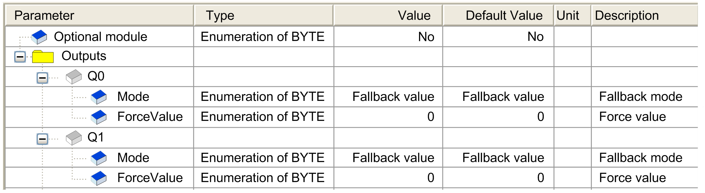

# I/O Configuration Tab

I/O Configuration Tab

This tab allows you to configure the module as an optional module:

If the module is connected to a distributed device, you can configure the [fallback behavior](../M238_OH_-_IO_General_Precautions/M238_OH_-_IO_General_Precautions-6.htm#XREF_D_SE_0095071_1).