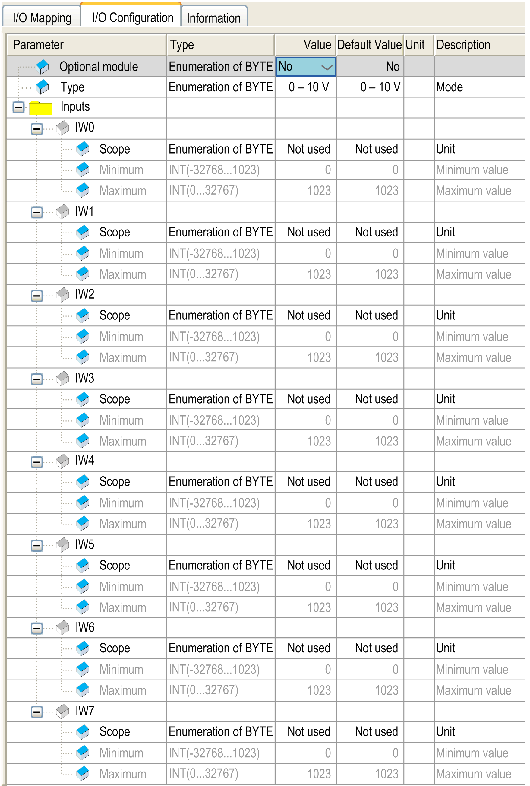

# I/O Configuration Tab

I/O Configuration Tab

This table allows you to configure the module as an optional module and configure the inputs.

For each input, you can define:

| Parameter | | Value | Default Value | Description |
| --- | --- | --- | --- | --- |
| Type | | Not used  0- 10 V  0- 20 mA | Not used | This identifies the mode of all channels. |
| Scope | | Normal  Customized | Normal | This identifies the range of values for the channel. |
| Minimum | Normal | 0 | 0 | Specifies the lower measurement limit. |
| Customized | -32768...32767 | -32768 |
| Maximum | Normal | 1023 | 1023 | Specifies the upper measurement limit. |
| Customized | -32768...32767 | 32767 |

For further generic descriptions, refer to [I/O Configuration Tab Description](../M238_OH_-_IO_General_Precautions/M238_OH_-_IO_General_Precautions-4.htm#XREF_D_SE_0006553_5).