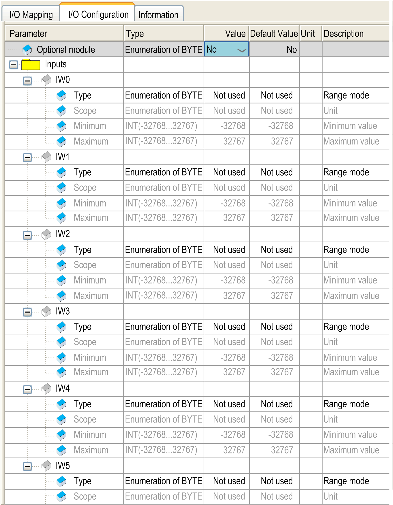

# I/O Configuration Tab

I/O Configuration Tab

This table allows you to configure the module as an optional module and configure the inputs.

For each input, you can define:

| Parameter | | Value | Default Value | Description |
| --- | --- | --- | --- | --- |
| Type | | Not used  PT100  PT1000 | Not used | This identifies the mode of the channel. |
| Scope | | Not used  Normal  Customized  Celsius (0.1 °C)  Fahrenheit (0.1 °F) | Not used | This identifies the range of values for the channel. |
| Minimum | Normal | 0 | 0 | Specifies the lower measurement limit. |
| Celsius (0.1 °C) | See the table below | See the table below |
| Fahrenheit (0.1 °F) |
| Customized | -32768...32767 | -32768 |
| Maximum | Normal | 4095 | 4095 | Specifies the upper measurement limit. |
| Celsius (0.1 °C) | See the table below | See the table below |
| Fahrenheit (0.1 °F) |
| Customized | -32768...32767 | 32767 |

| Scope | Normal | | Celsius (0.1 °C) | | Fahrenheit (0.1 °F) | |
| --- | --- | --- | --- | --- | --- | --- |
| Minimum | Maximum | Minimum | Maximum | Minimum | Maximum |
| PT100 | 0 | 4095 | -2000 | 6000 | -3280 | 11120 |
| PT1000 | 0 | 4095 | -500 | 2000 | -580 | 3920 |

For further generic descriptions, refer to [I/O Configuration Tab Description](../M238_OH_-_IO_General_Precautions/M238_OH_-_IO_General_Precautions-4.htm#XREF_D_SE_0006553_5).