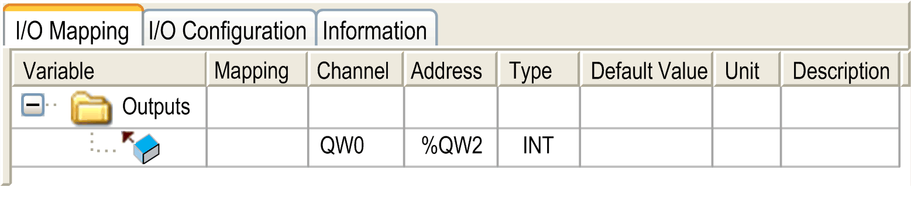

# I/O Mapping Tab

I/O Mapping Tab

This identifies the addresses of each input and the channel name:

| Channel | Type | Default Value | Description |
| --- | --- | --- | --- |
| QW0 | INT | -32768...32767 | Command word of the output 0 |

For further generic descriptions, refer to [I/O Mapping Tab Description](../M238_OH_-_IO_General_Precautions/M238_OH_-_IO_General_Precautions-4.htm#XREF_D_SE_0006553_6).