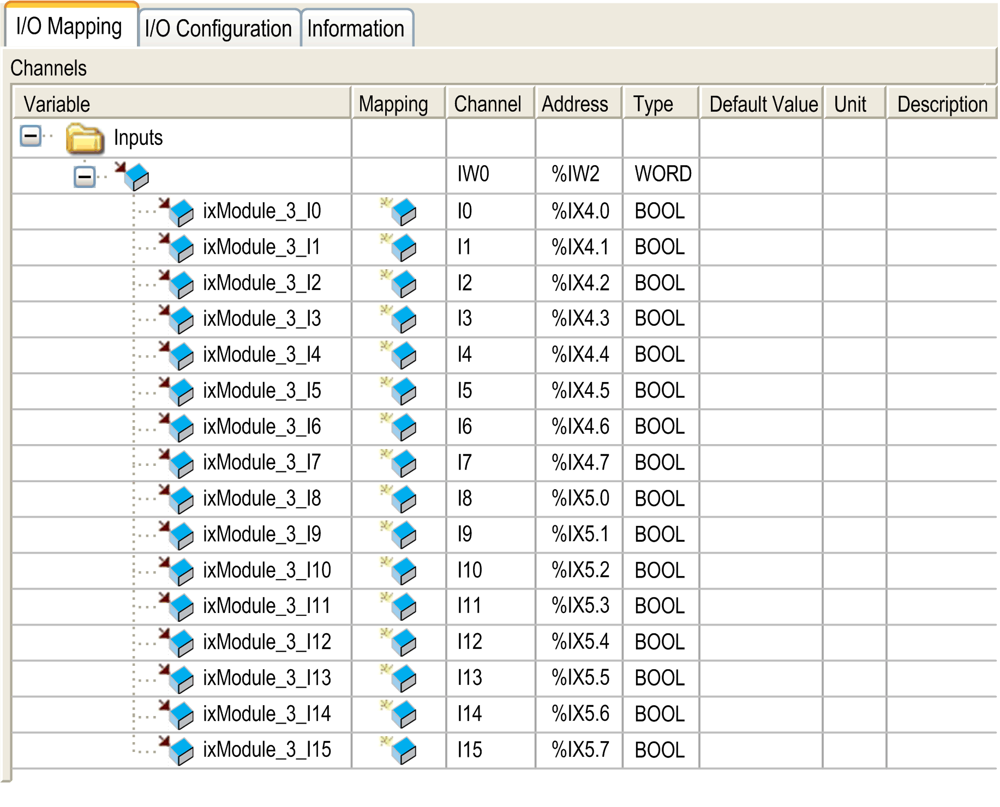
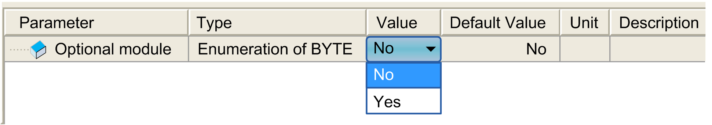

# TM2DDI16DT

TM2DDI16DT

Introduction

This expansion module is a 16-point, 24 Vdc input module with a terminal block.

For further hardware information, refer to [TM2DDI16DT](../../../../../../api/crossBook?lang=en-US&virtualBookName=tm2diohw&topicID=D_RU_0004607_1).

I/O Mapping Tab

This table identifies the addresses of each input and the channel name.

| Channel | Type | Description |
| --- | --- | --- |
| IW0 | [WORD](../glossary/glossary.htm#XREF_D_SE_0024697_601) | State of all inputs |
| I0 | BOOL | State of input 0 |
| ... | ... |
| I15 | State of input 15 |

For further generic descriptions, refer to [I/O Mapping Tab Description](../M238_OH_-_IO_General_Precautions/M238_OH_-_IO_General_Precautions-4.htm#XREF_D_SE_0006553_6).

I/O Configuration Tab

This tab allows you to configure the module as an option module:

EIO0000003432.00

© 2019 Schneider Electric. All rights reserved.