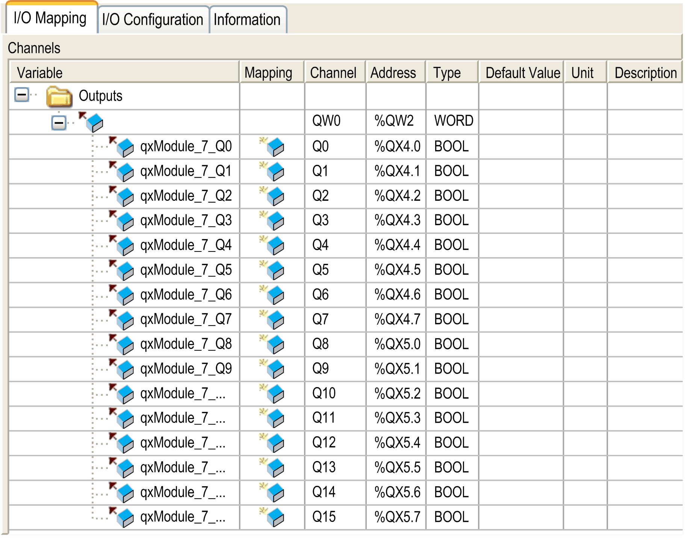

# TM2DDO8TT

TM2DDO8TT

Introduction

This expansion module is an 8-point transistor [source output](../glossary/glossary.htm#XREF_D_SE_0024697_409) module with a terminal block.

For further hardware information, refer to [TM2DDO8TT](../../../../../../api/crossBook?lang=en-US&virtualBookName=tm2diohw&topicID=D_RU_0004788_1).

I/O Mapping Tab

This table identifies the addresses of each output and the channel name.

| Channel | Type | Default Value | Description |
| --- | --- | --- | --- |
| QB0 | BYTE | - | Command byte of all outputs |
| Q0 | BOOL | -  TRUE  FALSE | Command bit of output 0 |
| ... | ... |
| Q7 | Command bit of output 7 |

For further generic descriptions, refer to [I/O Mapping Tab Description](../M238_OH_-_IO_General_Precautions/M238_OH_-_IO_General_Precautions-4.htm#XREF_D_SE_0006553_6).

I/O Configuration Tab

This tab allows you to configure the module as an optional module:

If the module is connected to a distributed device, you can configure the [fallback behavior](../M238_OH_-_IO_General_Precautions/M238_OH_-_IO_General_Precautions-6.htm#XREF_D_SE_0095071_1).

EIO0000003432.00

© 2019 Schneider Electric. All rights reserved.