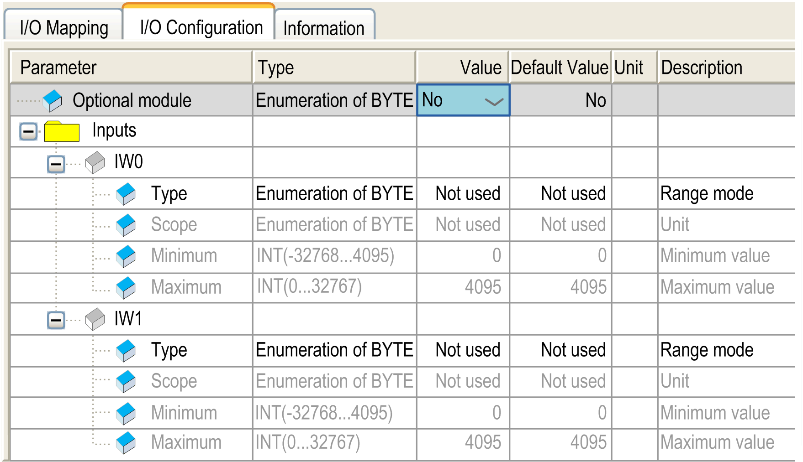
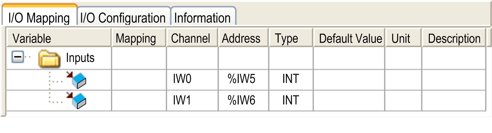

# TM2AMI2HT

TM2AMI2HT

Introduction

This expansion module is a 2-point input module with a terminal block.

For further hardware information, refer to [TM2AMI2HT](../../../../../../api/crossBook?lang=en-US&virtualBookName=tm2aiohw&topicID=D_RU_0004703_1).

If you have physically wired the analog channel for a voltage signal and you configure the channel for a current signal in EcoStruxure Machine Expert, you may damage the analog circuit.

|  |
| --- |
| NOTICE |
| INOPERABLE EQUIPMENT |
| Verify that the physical wiring of the analog circuit is compatible with the software configuration for the analog channel. |
| Failure to follow these instructions can result in equipment damage. |

I/O Configuration Tab

This table allows you to configure the module as an optional module and configure the inputs.

For each input, you can define:

| Parameter | | Value | Default Value | Description |
| --- | --- | --- | --- | --- |
| Type | | Not used  0- 10 V  4 - 20 mA | Not used | This identifies the mode of the channel. |
| Scope | | Normal  Customized | Normal | This identifies the range of values for the channel. |
| Minimum | Normal | 0 | 0 | Specifies the lower measurement limit. |
| Customized | -32768...32767 | -32768 |
| Maximum | Normal | 4095 | 4095 | Specifies the upper measurement limit. |
| Customized | -32768...32767 | 32767 |

For further generic descriptions, refer to [I/O Configuration Tab Description](../M238_OH_-_IO_General_Precautions/M238_OH_-_IO_General_Precautions-4.htm#XREF_D_SE_0006553_5).

I/O Mapping Tab

This identifies the addresses of each input and the channel name:

| Channel | Type | Description |
| --- | --- | --- |
| IW0 | [INT](../glossary/glossary.htm#XREF_D_SE_0024697_142) | Current value of the input 0 |
| IW1 | INT | Current value of the input 1 |

For further generic descriptions, refer to [I/O Mapping Tab Description](../M238_OH_-_IO_General_Precautions/M238_OH_-_IO_General_Precautions-4.htm#XREF_D_SE_0006553_6).

EIO0000003432.00

© 2019 Schneider Electric. All rights reserved.