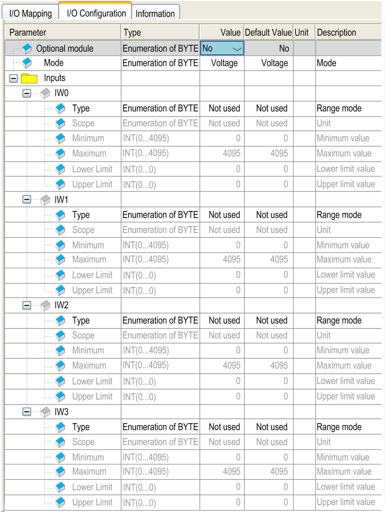
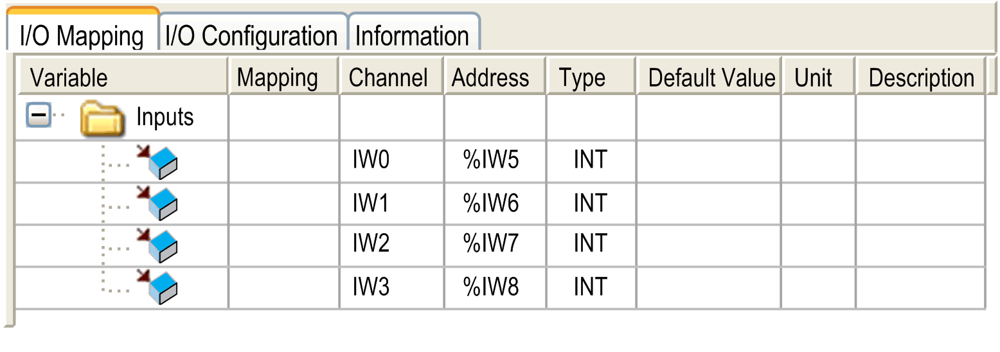

# TM2AMI4LT

TM2AMI4LT

Introduction

This expansion module is a 4-point input module, current, voltage and temperature, with a terminal block.

NOTE: All inputs used must be of the same type (voltage, current, or temperature).

For further hardware information, refer to [TM2AMI4LT](../../../../../../api/crossBook?lang=en-US&virtualBookName=tm2aiohw&topicID=D_RU_0004711_1).

If you have physically wired the analog channel for a voltage signal and you configure the channel for a current signal in EcoStruxure Machine Expert, you may damage the analog circuit.

|  |
| --- |
| NOTICE |
| INOPERABLE EQUIPMENT |
| Verify that the physical wiring of the analog circuit is compatible with the software configuration for the analog channel. |
| Failure to follow these instructions can result in equipment damage. |

I/O Configuration Tab

This table allows you to configure the module as an optional module and configure the inputs.

For each input, you can define:

| Parameter | | Value | Default Value | Description |
| --- | --- | --- | --- | --- |
| Mode | | Voltage  Current  Temperature | Voltage | This identifies the mode of all channels. |
| Type | | Not used  0...10 V  0...20 mA  PT100  PT1000  NI100  NI1000 | Not used | This identifies the type of the channel.  If ’Voltage’ mode is enabled, then the type ‘Not used’ and ‘0...10V’ are available.  If ’Current’ mode is enabled, then the type ‘Not used’ and ‘0...20 mA’ are available.  If ’Temperature’ mode is enabled, then the type ‘Not used’, ‘PT100’, PT1000’, ‘NI100’ and ‘NI1000’ are available. |
| Scope | | Not used  Normal  Customized  Resistance (Ohm)  Celsius (0.1 °C)  Fahrenheit (0.1 °F) | Not used | This identifies the range of values for the channel. |
| Minimum | Normal | 0 | 0 | Specifies the lower measurement limit. |
| Celsius (0.1 °C) | See the table below | See the table below |
| Fahrenheit (0.1 °F) |
| Resistance (Ohm) |
| Customized | -32768...32767 | -32768 |
| Maximum | Normal | 4095 | 4095 | Specifies the upper measurement limit. |
| Celsius (0.1 °C) | See the table below | See the table below |
| Fahrenheit (0.1 °F) |
| Resistance (Ohm) |
| Customized | -32768...32767 | 32767 |

| Scope | Normal | | Resistance (Ohm) | | Celsius (0.1 °C) | | Fahrenheit (0.1 °F) | |
| --- | --- | --- | --- | --- | --- | --- | --- | --- |
| Minimum | Maximum | Minimum | Maximum | Minimum | Maximum | Minimum | Maximum |
| PT100 | 0 | 4095 | 18 | 314 | -2000 | 6000 | -3280 | 11120 |
| PT1000 | 0 | 4095 | 184 | 3138 | -2000 | 6000 | -3280 | 11120 |
| NI100 | 0 | 4095 | 74 | 199 | -500 | 1500 | -580 | 3020 |
| NI1000 | 0 | 4095 | 742 | 1987 | -500 | 1500 | -580 | 3020 |

For further generic descriptions, refer to [I/O Configuration Tab Description](../M238_OH_-_IO_General_Precautions/M238_OH_-_IO_General_Precautions-4.htm#XREF_D_SE_0006553_5).

I/O Mapping Tab

This identifies the addresses of each input and the channel name:

| Channel | Type | Description |
| --- | --- | --- |
| IW0 | INT | Current value of the input 0 |
| IW1 | INT | Current value of the input 1 |
| IW2 | INT | Current value of the input 2 |
| IW3 | INT | Current value of the input 3 |

For further generic descriptions, refer to [I/O Mapping Tab Description](../M238_OH_-_IO_General_Precautions/M238_OH_-_IO_General_Precautions-4.htm#XREF_D_SE_0006553_6).

EIO0000003432.00

© 2019 Schneider Electric. All rights reserved.