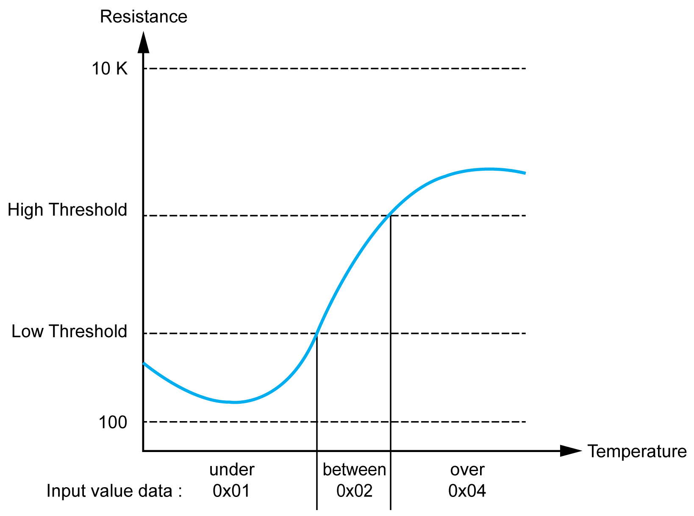
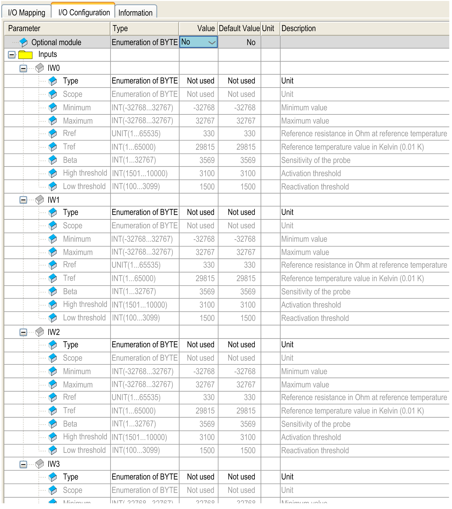
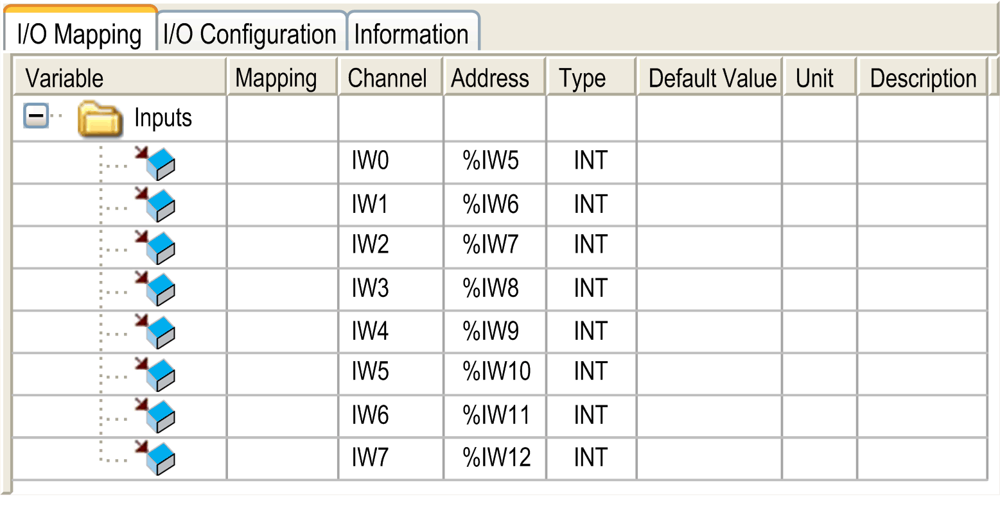

# TM2ARI8HT

TM2ARI8HT

Introduction

This expansion module is an 8-point input module, temperature, with a terminal block.

For further hardware information, refer to [TM2ARI8HT](../../../../../../api/crossBook?lang=en-US&virtualBookName=tm2aiohw&topicID=D_RU_0004713_1).

If you have physically wired the analog channel for a voltage signal and you configure the channel for a current signal in EcoStruxure Machine Expert, you may damage the analog circuit.

|  |
| --- |
| NOTICE |
| INOPERABLE EQUIPMENT |
| Verify that the physical wiring of the analog circuit is compatible with the software configuration for the analog channel. |
| Failure to follow these instructions can result in equipment damage. |

NTC Probe

The temperature (Tm) varies in relation to the resistance (r) following the equation below:

Where:

oTm = temperature measured by the probe, in Kelvin

or = physical value of the resistance in Ohm

oR = reference resistance in Ohm at temperature T

oT = reference temperature in Kelvin

oB = sensitivity of the NTC probe in Kelvin

R,T, and B must be greater or equal to 1.

If the resistance is selected as unit, the displayed value is equal to the probe resistance.

NOTE: 25 °C = 77 °F = 298.15 K

PTC Probe

This table shows the read value according to the resistance value:

| Resistance Value | Read Value |
| --- | --- |
| Less than low threshold | 1 |
| Between threshold | 2 |
| Greater than high threshold | 4 |

I/O Configuration Tab

This table allows you to configure the module as an optional module and configure the inputs.

For each input, you can define:

| Parameter | | Value | Default Value | Description |
| --- | --- | --- | --- | --- |
| Type | | Not used  NTC  PTC | Not used | This identifies the mode of the channel. |
| Scope | | Normal  Customized  Resistance (Ohm)  Celsius (0.1 °C)  Fahrenheit (0.1 °F) | Normal for NTC type  Resistance (Ohm) for PTC type | This identifies the range of values for the channel. |
| Minimum | Normal | 0 | 0 | Specifies the lower measurement limit. |
| Customized | -32768...32767 | -32768 |
| Maximum | Normal | 1023 | 1023 | Specifies the upper measurement limit. |
| Customized | -32768...32767 | 32767 |
| Rref (used only with NTC probe) | | 1...65535 | 330 | Reference resistance in Ohm at temperature Tref |
| Tref (used only with NTC probe) | | 1...65000 | 29815 | Reference temperature value in Kelvin (0.01 K) |
| Beta (used only with NTC probe) | | 1...32767 | 3569 | Sensitivity of NTC probe in Kelvin (0.01 K) |
| High threshold (used only with PTC probe) | | 100...10000 | 3100 | Activation threshold |
| Low threshold (used only with PTC probe) | | 100...10000 | 1500 | Reactivation threshold |

| Scope | Resistance (Ohm) | | Celsius (0.1 °C) | | Fahrenheit (0.1 °F) | |
| --- | --- | --- | --- | --- | --- | --- |
| Minimum | Maximum | Minimum | Maximum | Minimum | Maximum |
| NTC | 100 | 10000 | -789 | 2114 | -1101 | 4125 |
| PTC | 100 | 10000 | - | - | - | - |

For further generic descriptions, refer to [I/O Configuration Tab Description](../M238_OH_-_IO_General_Precautions/M238_OH_-_IO_General_Precautions-4.htm#XREF_D_SE_0006553_5).

I/O Mapping Tab

This identifies the addresses of each input and the channel name:

| Channel | Type | Description |
| --- | --- | --- |
| IW0 | INT | Current value of the input 0 |
| ... | ... | ... |
| IW7 | INT | Current value of the input 7 |

For further generic descriptions, refer to [I/O Mapping Tab Description](../M238_OH_-_IO_General_Precautions/M238_OH_-_IO_General_Precautions-4.htm#XREF_D_SE_0006553_6).

EIO0000003432.00

© 2019 Schneider Electric. All rights reserved.