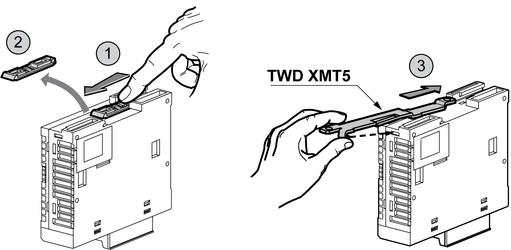

# Installing the Panel Mount Kit

Installing the Panel Mount Kit

The following procedure shows how to install a mounting strip.

| Step | Action |
| --- | --- |
| 1 | Remove the clip-on-lock from the back side of the module by pushing the clip-on lock upwards. |
| 2 | Insert the mounting strip, with the hook entering last, into the slot where the clip-on lock was removed. |
| 3 | Slide the mounting strip into the slot until the hook enters into the recess in the module. |

The following illustration shows how to attach the TWDXMT5 Panel Mount Kit to a module:

