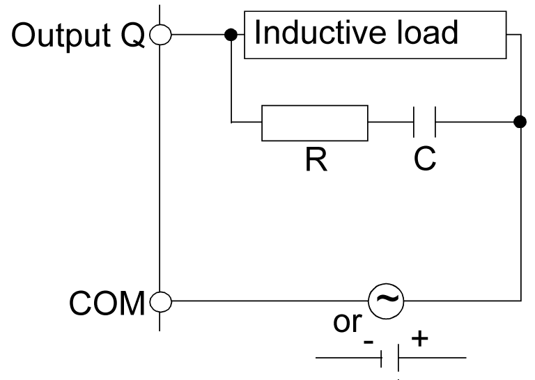
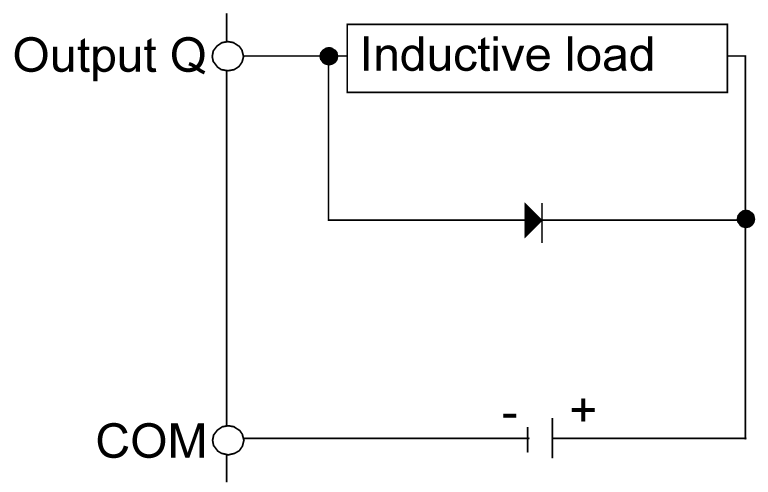

# Protecting Outputs from Inductive Load Damage

Protecting Outputs from Inductive Load Damage

Depending on the load, a protection circuit may be needed for the outputs on the controllers and certain modules. Inductive loads using DC voltages may create voltage reflections resulting in overshoot that will damage or shorten the life of output devices.

|  |
| --- |
| Caution_Color.gifCAUTION |
| OUTPUT CIRCUIT DAMAGE DUE TO INDUCTIVE LOADS |
| Use an appropriate external protective circuit or device to reduce the risk of inductive direct current load damage. |
| Failure to follow these instructions can result in injury or equipment damage. |

If your controller or module contains relay outputs, these types of outputs can support up to 240 Vac. Inductive damage to these types of outputs can result in welded contacts and loss of control. Each inductive load must include a protection device such as a peak limiter, RC circuit or flyback diode. Capacitive loads are not supported by these relays.

|  |
| --- |
| Warning_Color.gifWARNING |
| RELAY OUTPUTS WELDED CLOSED |
| oAlways protect relay outputs from inductive alternating current load damage using an appropriate external protective circuit or device.  oDo not connect relay outputs to capacitive loads. |
| Failure to follow these instructions can result in death, serious injury, or equipment damage. |

Protective circuit A: this protection circuit can be used for both AC and DC load power circuits.

oC represents a value from 0.1 to 1 μF.

oR represents a resistor of approximately the same resistance value as the load.

Protective circuit B: this protection circuit can be used for DC load power circuits.

Use a diode with the following ratings:

oReverse withstand voltage: power voltage of the load circuit x 10.

oForward current: more than the load current.

Protective circuit C: this protection circuit can be used for both AC and DC load power circuits.

oIn applications where the inductive load is switched on and off frequently and/or rapidly, ensure that varistor’s continuous energy rating (J) exceeds the peak load energy by 20% or more.

NOTE: The above schematics show sinking DC outputs, but would apply equally to source outputs.