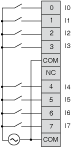

# TM2DDAI8DT Wiring Diagram

TM2DDAI8DT Wiring Diagram

The following diagram shows the connection of the inputs module (on the right) to the sensors (on the left).

The two COM terminals are not connected together internally.

|  |
| --- |
| Warning_Color.gifWARNING |
| UNINTENDED EQUIPMENT OPERATION |
| Do not connect wires to unused terminals and/or terminals indicated as “No Connection (N.C.)”. |
| Failure to follow these instructions can result in death, serious injury, or equipment damage. |