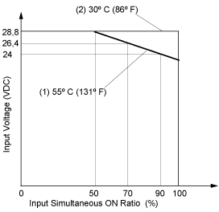

# Usage Limits

Usage Limits

When using TM2DDI8DT:

1   90% of the inputs can be turned on simultaneously at 55 °C, 24 Vdc input voltage.

2   All inputs can be turned on simultaneously at 30 °C, 28.8 Vdc input voltage.