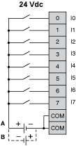

# TM2DDI8DT Wiring Diagram

TM2DDI8DT Wiring Diagram

The following diagram shows the connection of the inputs module (on the right) to the sensors (on the left).

oThe COM terminals are connected together internally.

oBoth sink and source input wiring are supported.

oA is the sink wiring (positive logic).

oB is the source wiring (negative logic).

|  |
| --- |
| Warning_Color.gifWARNING |
| UNINTENDED EQUIPMENT OPERATION |
| Do not connect wires to unused terminals and/or terminals indicated as “No Connection (N.C.)”. |
| Failure to follow these instructions can result in death, serious injury, or equipment damage. |