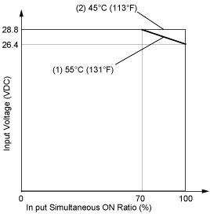

# Usage Limits

Usage Limits

When using TM2DDI16DT:

1   At 55°C (131 °F) in the normal mounting direction, limit the inputs which turn on simultaneously along line.

2   At 45°C (113 °F), all inputs can be turned on simultaneously at 28.8 Vdc as indicated with line.