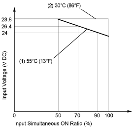

# Usage Limits

Usage Limits

When using TM2DDI16DK:

1   At 55 °C (131 °F), limit the inputs which turn on simultaneously on each connector along line.

2   At 30 °C (86 °F), all inputs can be turned on simultaneously at 28.8 Vdc as indicated with line.