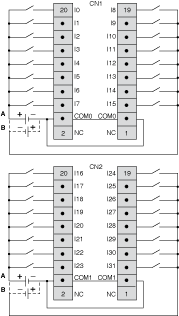

# TM2DDI32DK Wiring Diagram

TM2DDI32DK Wiring Diagram

The following diagram shows the connection of the inputs module to the sensors.

oThe COM0 terminals are connected together internally.

oThe COM1 terminals are connected together internally.

oThe COM0 and COM1 terminals are not connected together internally.

oBoth sink and source input wiring are supported

oA is the sink wiring (positive logic).

oB is the source wiring (negative logic).

|  |
| --- |
| Warning_Color.gifWARNING |
| UNINTENDED EQUIPMENT OPERATION |
| Do not connect wires to unused terminals and/or terminals indicated as “No Connection (N.C.)”. |
| Failure to follow these instructions can result in death, serious injury, or equipment damage. |