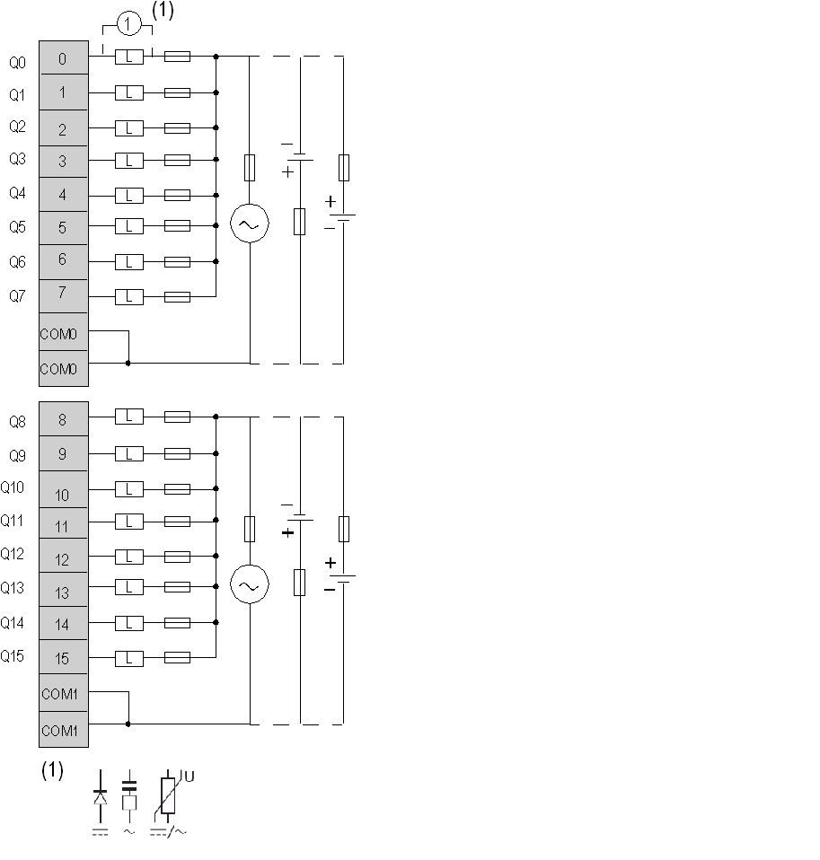

# TM2DRA16RT Wiring Diagram

TM2DRA16RT Wiring Diagram

The following diagram shows the connection of the outputs and [the relay output wiring](../Modules_General_Overview/Modules_General_Overview-12.htm#XREF_D_RU_0004606_13).

oThe COM0 terminals are connected together internally.

oThe COM1 terminals are connected together internally.

oThe COM0 and COM1 terminals are not connected together internally.

oConnect an appropriate fuse for the load.

o(1) is the protection for inductive load.

|  |
| --- |
| Warning_Color.gifWARNING |
| UNINTENDED EQUIPMENT OPERATION |
| Do not connect wires to unused terminals and/or terminals indicated as “No Connection (N.C.)”. |
| Failure to follow these instructions can result in death, serious injury, or equipment damage. |