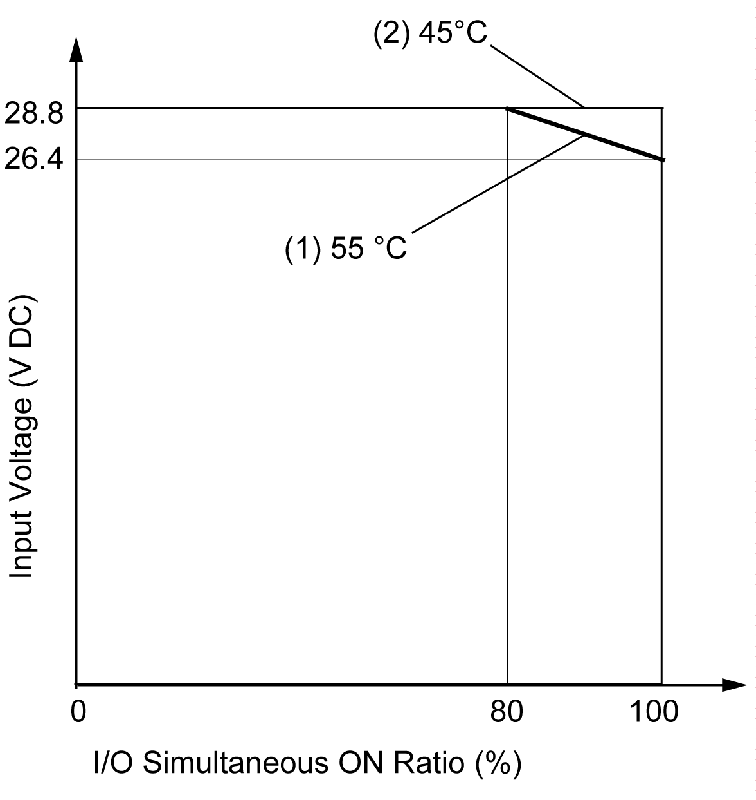

# Usage Limits

Usage Limits

When using TM2DMM24DRF:

1   At an ambient temperature of 55°C (131°F) in the normal mounting direction, limit the inputs and outputs, respectively, which turn on simultaneously along line.

2   At 45°C (113°F), all inputs and outputs can be turned on simultaneously at 28.8 Vdc as indicated with line.