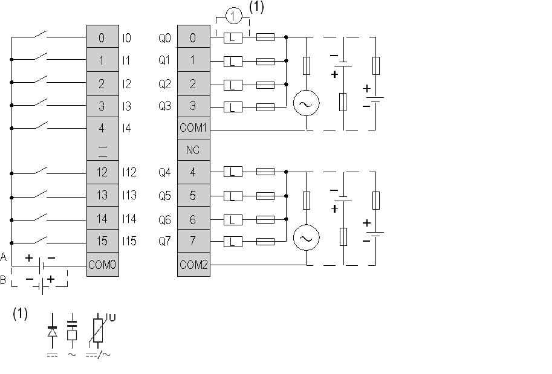

# TM2DMM24DRF Wiring Diagram

TM2DMM24DRF Wiring Diagram

The following diagram shows the connection of the inputs module to the sensors (on the left) and the connection of the outputs with [the relay output wiring](../Modules_General_Overview/Modules_General_Overview-12.htm#XREF_D_RU_0004606_13) (on the right).

oThe COM0, COM1 and COM2 terminals are not connected together internally.

oConnect an appropriate fuse for the load, not to exceed 2 A on the outputs and 7 A on the output power supply.

oBoth sink and source input wiring are supported

oA is the sink wiring (positive logic).

oB is the source wiring (negative logic).

o(1) is the protection for inductive load.

|  |
| --- |
| Warning_Color.gifWARNING |
| UNINTENDED EQUIPMENT OPERATION |
| Do not connect wires to unused terminals and/or terminals indicated as “No Connection (N.C.)”. |
| Failure to follow these instructions can result in death, serious injury, or equipment damage. |