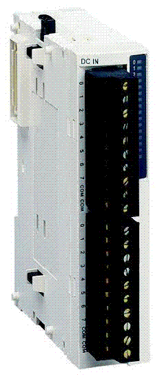

# TM2 Digital I/O Modules - Hardware Guide

TM2 Digital I/O Modules - Hardware Guide

TM2 Digital I/O Expansion Modules - Hardware Guide

This guide describes the hardware implementation of TM2 digital I/O expansion modules. It provides parts descriptions, specifications, wiring diagrams, installation, and setup for TM2 digital I/O expansion modules.

EIO0000000028.08

© 2020 Schneider Electric. All rights reserved.