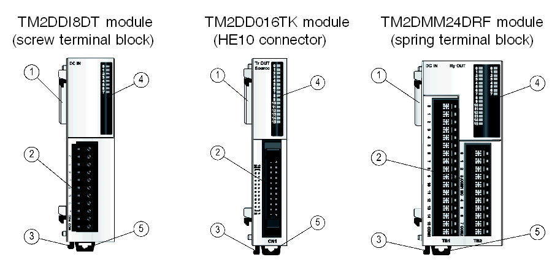

# Physical description

Physical description

Introduction

This section describes the parts of 3 digital I/O modules, one with a HE10 connector, one with a removable screw terminal bock and one with a non removable spring terminal block. In general, the modules with a HE10 connector have a reference ending in K whereas the modules with a terminal block have a reference ending in T. Your I/O module may differ from the illustrations but the parts will be the same.

Illustration

The following pictures show the parts of the 3 digital I/O modules:

Elements

The following table describes the different elements of the 3 digital I/O modules shown above:

| Label | TM2DDI8DT | TM2DDO16TK | TM2DMM24DRF |
| --- | --- | --- | --- |
| 1 | [Expansion connector](../glossary/glossary.htm#XREF_D_SE_0024697_696) for electrical connection (one on each side, right side not shown). It is designed to provide continuity of the electrical link between the modules connected. | | |
| 2 | Removable screw terminal block (supplied with the module) | HE10 Connector | Non removable spring terminal block |
| 3 | Locking device for attachment to the previous module | | |
| 4 | Led for displaying the channels and module diagnostics | | |
| 5 | Clip-on lock | | |

EIO0000000028.08

© 2020 Schneider Electric. All rights reserved.