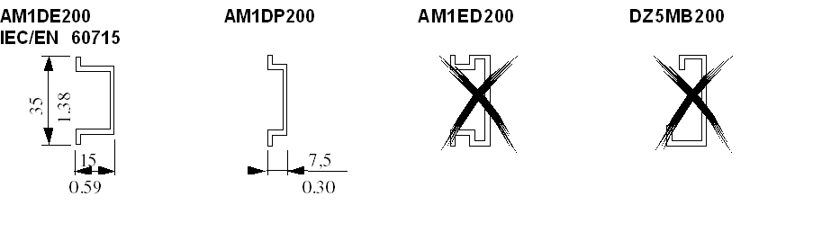

# Accessories

Accessories

Introduction

This section describes the TM2 Digital I/O modules accessories.

Cables

The following table lists the cables features:

| Cable name | Reference |
| --- | --- |
| Digital I/O Cables |  |
| Cable equipped at a one end with an HE10 connector. (AWG 22 / 0.34 mm2; length: 3 m / 9.84 ft) | TWDFCW30K |
| Cable equipped at a one end with an HE10 connector. (AWG 22 / 0.34 mm2; length: 5 m / 16.4 ft) | TWDFCW50K |
| Telefast® Cables for TM2 digital I/O expansion modules |  |
| Cable equipped with a HE10 connector at each end. (AWG 28 / 0.08 mm2; length: 0.5 m / 1.64 ft) | ABFT20E050 |
| Cable equipped with a HE10 connector at each end. (AWG 28 / 0.08 mm2; length: 1 m / 3.28 ft) | ABFT20E100 |
| Cable equipped with a HE10 connector at each end. (AWG 28 / 0.08 mm2; length: 2 m / 6.56 ft) | ABFT20E200 |

Terminal Block End Clamp Type AB1AB8P35

Terminal Block End Clamps (reference AB1AB8P35) help reduce side-to-side movement of your controller and modules on the mounting rail. A controller and its associated modules are mounted on the mounting rail between two end clamps in order to improve the shock and vibration characteristics of the assembly.

The following picture shows an end clamps type AB1AB8P35:

The DIN Rail

 You can mount the controller and its expansions on a mounting rail. A mounting rail can be attached to a smooth mounting surface or suspended from a Electronic Industries Alliance rack or in a Type 4 cabinet.

The following picture shows the different sizes of the DIN rail:

You can order the suitable DIN rail from Schneider Electric:

| Rail depth | Catalogue part number |
| --- | --- |
| 15 mm (0.59 in.) | AM1DE200 |
| 7,5 mm (0.30 in.) | AM1DP200 |

NOTE: Do not use AM1ED200 and DZ5MB200

TWDXMT5 Mounting Strip

 The following illustration shows a TWDXMT5 Panel Mount Kit which can be used instead of mounting rail to mount your controller and I/O modules directly to a panel:

EIO0000000028.08

© 2020 Schneider Electric. All rights reserved.