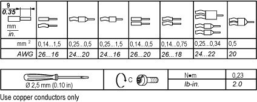
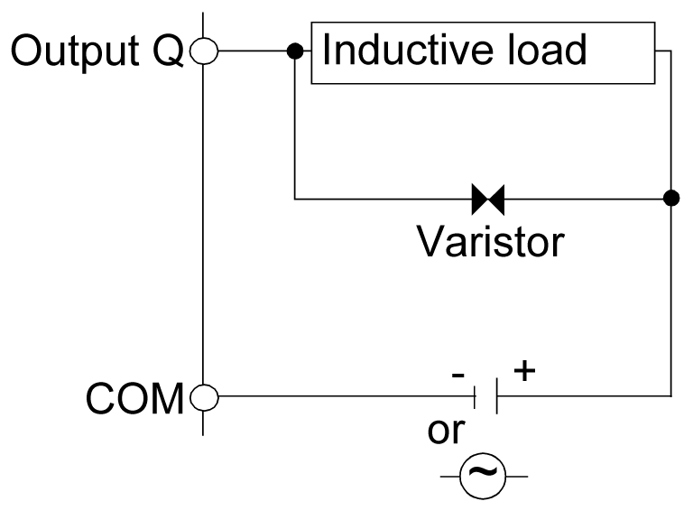
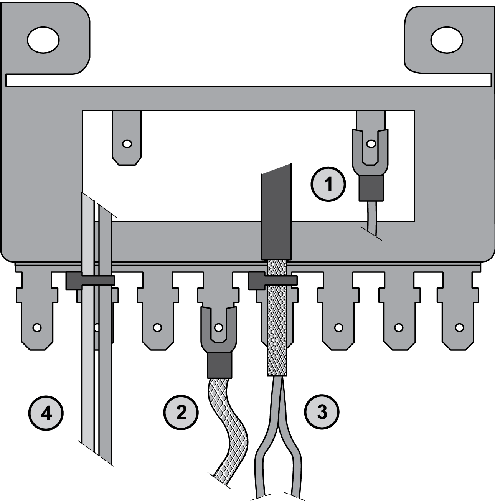

# Wiring Requirements

Wiring Requirements

Introduction

There are several rules that must be followed when wiring a TM2 I/O module.

For modules that have more than one terminal block or connector that is identical, any of them can be potentially plugged into any socket.

Despite the indicators on the terminal blocks, connectors and modules, it is possible to incorrectly install the terminal blocks or connectors and create incorrect wiring.

Plugging a connector into the wrong socket could cause unintended behavior of the application.

|  |
| --- |
| DangerElectrical_Color.gifDanger_Color.gifDANGER |
| ELECTRIC SHOCK OR UNINTENDED EQUIPMENT OPERATION |
| Connect the terminal blocks to their designated location. |
| Failure to follow these instructions will result in death or serious injury. |

NOTE: Clearly and uniquely label each terminal block and connector with an appropriate system of identification.

Wiring Guidelines

|  |
| --- |
| DangerElectrical_Color.gifDanger_Color.gifDANGER |
| HAZARD OF ELECTRIC SHOCK, EXPLOSION OR ARC FLASH |
| oDisconnect all power from all equipment including connected devices prior to removing any covers or doors, or installing or removing any accessories, hardware, cables, or wires except under the specific conditions specified in the appropriate hardware guide for this equipment.  oAlways use a properly rated voltage sensing device to confirm the power is off where and when indicated.  oReplace and secure all covers, accessories, hardware, cables, and wires and confirm that a proper ground connection exists before applying power to the unit.  oUse only the specified voltage when operating this equipment and any associated products. |
| Failure to follow these instructions will result in death or serious injury. |

The following rules must be applied when wiring the digital I/O modules:

oI/O and communication wiring must be kept separate from the power wiring. Route these 2 types of wiring in separate cable ducting.

oVerify that the operating conditions and environment are within the specification values.

oUse proper wire sizes to meet voltage and current requirements.

oUse copper conductors only.

oUse twisted-pair, shielded cables for analog, expert and/or fast I/O.

oUse twisted-pair, shielded cables for networks and field bus (CANopen, serial, Ethernet).

|  |
| --- |
| Warning_Color.gifWARNING |
| UNINTENDED EQUIPMENT OPERATION |
| oUse shielded cables for all input, output and communication types specified above.  oProperly ground the cable shields as indicated in the related documentation.  oRoute communications and I/O cables separately from power cables. |
| Failure to follow these instructions can result in death, serious injury, or equipment damage. |

For more details, refer to [Grounding](#XREF_D_RU_0004606_15).

The following table shows the cable types and wire sizes for removable screw terminal block:

Applying torque above the limit may damage the terminal screw or threads.

|  |
| --- |
| NOTICE |
| INOPERABLE EQUIPMENT |
| Do not tighten screw terminals beyond the specified maximum torque (Nm / lb-in.). |
| Failure to follow these instructions can result in equipment damage. |

The table below shows the characteristics of the non-removable spring terminal blocks:

| Characteristic | | Available |
| --- | --- | --- |
| Type of terminal blocks | | Spring terminal blocks |
| Number of wires or cable ends accommodated | | 1 |
| Wire gauges accommodated | minimum | AWG 20 (0.5 mm2) |
| maximum | AWG 18 (1 mm2) |
| Wiring constraints | | To insert and remove wires from the connectors, use a 2,5 x 0,4 mm (0.10 x 0.02 in) screwdriver to open the round receptacle by pushing on the corresponding plate. Push the flexible plate down on the outside (the side closest to the corresponding receptacle).  A screwing (rotating) or bending motion is not required. |

Protecting Outputs from Inductive Load Damage

Depending on the load, a protection circuit may be needed for the outputs on the controllers and certain modules. Inductive loads using DC voltages may create voltage reflections resulting in overshoot that will damage or shorten the life of output devices.

|  |
| --- |
| Caution_Color.gifCAUTION |
| OUTPUT CIRCUIT DAMAGE DUE TO INDUCTIVE LOADS |
| Use an appropriate external protective circuit or device to reduce the risk of inductive direct current load damage. |
| Failure to follow these instructions can result in injury or equipment damage. |

If your controller or module contains relay outputs, these types of outputs can support up to 240 Vac. Inductive damage to these types of outputs can result in welded contacts and loss of control. Each inductive load must include a protection device such as a peak limiter, RC circuit or flyback diode. Capacitive loads are not supported by these relays.

|  |
| --- |
| Warning_Color.gifWARNING |
| RELAY OUTPUTS WELDED CLOSED |
| oAlways protect relay outputs from inductive alternating current load damage using an appropriate external protective circuit or device.  oDo not connect relay outputs to capacitive loads. |
| Failure to follow these instructions can result in death, serious injury, or equipment damage. |

Protective circuit A: this protection circuit can be used for both AC and DC load power circuits.

oC represents a value from 0.1 to 1 μF.

oR represents a resistor of approximately the same resistance value as the load.

Protective circuit B: this protection circuit can be used for DC load power circuits.

Use a diode with the following ratings:

oReverse withstand voltage: power voltage of the load circuit x 10.

oForward current: more than the load current.

Protective circuit C: this protection circuit can be used for both AC and DC load power circuits.

oIn applications where the inductive load is switched on and off frequently and/or rapidly, ensure that varistor’s continuous energy rating (J) exceeds the peak load energy by 20% or more.

NOTE: The above schematics show sinking DC outputs, but would apply equally to source outputs.

Grounding

Electromagnetic radiation may interfere with control communications and/or input/ouput signals to the control system.

Use shielded, properly grounded cables for all analog and high-speed inputs or outputs and communication connections. If you do not use shielded cable for these connections, electromagnetic interference can cause signal degradation. Degraded signals can cause the controller or attached modules and equipment to perform in an unintended manner.

|  |
| --- |
| Warning_Color.gifWARNING |
| UNINTENDED EQUIPMENT OPERATION |
| oUse shielded cables for all fast I/O, analog I/O and communication signals.  oGround cable shields for all analog I/O, fast I/O and communication signals at a single point1.  oRoute communication and I/O cables separately from power cables. |
| Failure to follow these instructions can result in death, serious injury, or equipment damage. |

1Multipoint grounding is permissible if connections are made to an equipotential ground plane dimensioned to help avoid cable shield damage in the event of power system short-circuit currents.

Grounding Bar TM2XMTGB

The figure below shows how to connect the grounding bar TM2XMTGB:

1   Controller functional grounding

2   Modules functional grounding

3   Analog fast I/O cable shielding

4   Cable attachment

NOTE: Schneider Electric recommends the use of the TM2XMTGB the Grounding Bar for use with all TM2 I/O modules.

|  |
| --- |
| Warning_Color.gifWARNING |
| ACCIDENTAL DISCONNECTION FROM PROTECTIVE GROUND (PE) |
| oDo not use the TM2 XMTGB Grounding Bar to provide a protective ground (PE).  oUse the TM2 XMTGB Grounding Bar only to provide a functional ground (FE). |
| Failure to follow these instructions can result in death, serious injury, or equipment damage. |

EIO0000000028.08

© 2020 Schneider Electric. All rights reserved.