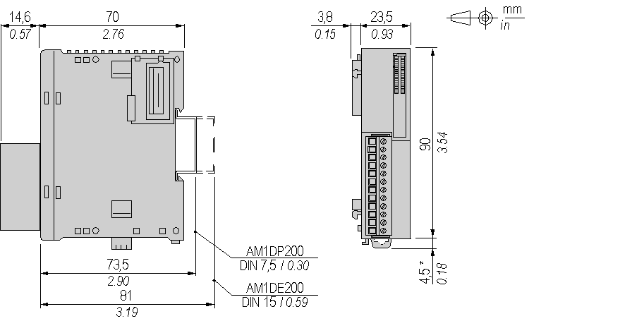

# Characteristics of the TM2DAI8DT Module

Characteristics of the TM2DAI8DT Module

Introduction

This section provides a description of the electrical and the input characteristics of the TM2DAI8DT module.

See also [Environmental Characteristics](../TM2_Discrete_I_O_Presentation_all_Modules/TM2_Discrete_I_O_Presentation_all_Modules.htm#XREF_D_RU_0004605_1).

|  |
| --- |
| Warning_Color.gifWARNING |
| UNINTENDED EQUIPMENT OPERATION |
| Do not exceed any of the rated values specified in the environmental and electrical characteristics tables. |
| Failure to follow these instructions can result in death, serious injury, or equipment damage. |

Dimensions

The following diagrams show the dimensions for the TM2DAI8DT module.

NOTE: \* 8.5 mm (0.33 in) when the clamp is pulled out.

TM2DAI8DT Electrical Characteristics

|  |  |
| --- | --- |
| Isolation | Between input and internal bus: 1500 Vac  Between [input terminals](../glossary/glossary.htm#XREF_D_SE_0024697_292): not isolated |
| Connector insertion/removal durability | Over 100 times |
| Current draw on 5 Vdc internal bus | 55 mA (all outputs on)  25 mA (all outputs off) |
| Current draw on 24 Vdc internal bus | 0 mA (all outputs on)  0 mA (all outputs off) |

TM2DAI8DT Input Characteristics

|  |  |
| --- | --- |
| Number of input channels | 8 |
| Common lines | 2 |
| Input signals type | AC type |
| Rated input voltage | 120 Vac |
| Input voltage range | 85...132 Vac |
| Rated input current at 100 Vac | 7.5 mA |
| Input impedance | 11 kΩ |
| OFF state | U < 20 Vac |
| ON state | U > 79 Vac  I > 2 mA |
| Turn on time | 25 ms |
| Turn off time | 30 ms |
| Input type | Type 1 (IEC 61131-2) |

EIO0000000028.08

© 2020 Schneider Electric. All rights reserved.