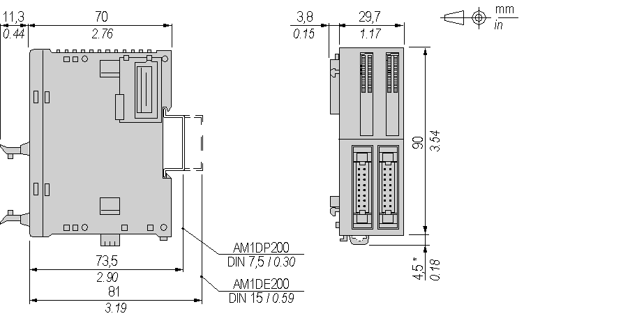
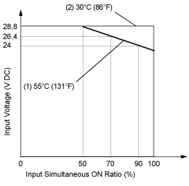

# Characteristics of the TM2DDI32DK Module

Characteristics of the TM2DDI32DK Module

Introduction

This section provides a description of the electrical and the input characteristics of the TM2DDI32DK module.

See also [Environmental Characteristics](../TM2_Discrete_I_O_Presentation_all_Modules/TM2_Discrete_I_O_Presentation_all_Modules.htm#XREF_D_RU_0004605_1).

|  |
| --- |
| Warning_Color.gifWARNING |
| UNINTENDED EQUIPMENT OPERATION |
| Do not exceed any of the rated values specified in the environmental and electrical characteristics tables. |
| Failure to follow these instructions can result in death, serious injury, or equipment damage. |

Dimensions

The following diagrams show the dimensions for the TM2DDI32DK module.

NOTE: \* 8.5 mm (0.33 in) when the clamp is pulled out.

TM2DDI32DK Electrical Characteristics

|  |  |
| --- | --- |
| Isolation | Between input and internal bus: 500 Vac  Between [input terminals](../glossary/glossary.htm#XREF_D_SE_0024697_292): not isolated |
| Connector insertion/removal durability | Over 100 times |
| Current draw on 5 Vdc internal bus | 65 mA (all inputs on)  10 mA (all inputs off) |
| Current draw on 24 Vdc internal bus | 0 mA (all inputs on)  0 mA (all inputs off) |

TM2DDI32DK Input Characteristics

|  |  |
| --- | --- |
| Number of input channels | 32 |
| Common lines | 1 common line for 16 channels |
| Input signals type | sink or source |
| Rated input voltage | 24 Vdc |
| Input voltage range | 20.4...28.8 Vdc |
| Rated input current at 24 Vdc | 5 mA |
| Input impedance | 4.4 kΩ |
| OFF state | U < 5 Vdc |
| ON state | U > 15 Vdc  I > 2 mA |
| Turn on time | 4 ms |
| Turn off time | 4 ms |
| Input type | Type 1 (IEC 61131-2) |

Usage Limits

When using TM2DDI32DK:

1   At 55°C (131°F), limit the inputs which turn on simultaneously on each connector along line.

2   At 30°C (86°F), all inputs can be turned on simultaneously at 28.8 Vdc as indicated with line.

EIO0000000028.08

© 2020 Schneider Electric. All rights reserved.