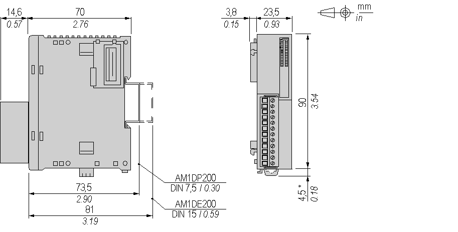

# Characteristics of the TM2DRA8RT Module

Characteristics of the TM2DRA8RT Module

Introduction

This section provides a description of the power limitation, the electrical and the output character­istics of the TM2DRA8RT module.

See also [Environmental Characteristics](../TM2_Discrete_I_O_Presentation_all_Modules/TM2_Discrete_I_O_Presentation_all_Modules.htm#XREF_D_RU_0004605_1).

|  |
| --- |
| Danger_Color.gifDANGER |
| FIRE HAZARD |
| oUse only the correct wire sizes for the maximum current capacity of the I/O channels and power supplies.  oFor relay output (2 A) wiring, use conductors of at least 0.5 mm2 (AWG 20) with a temperature rating of at least 80 °C (176 °F).  oFor common conductors of relay output wiring (7 A), or relay output wiring greater than 2 A, use conductors of at least 1.0 mm2 (AWG 16) with a temperature rating of at least 80 °C (176 °F). |
| Failure to follow these instructions will result in death or serious injury. |

|  |
| --- |
| Warning_Color.gifWARNING |
| UNINTENDED EQUIPMENT OPERATION |
| Do not exceed any of the rated values specified in the environmental and electrical characteristics tables. |
| Failure to follow these instructions can result in death, serious injury, or equipment damage. |

Dimensions

The following diagrams show the dimensions for the TM2DRA8RT module.

NOTE: \* 8.5 mm (0.33 in) when the clamp is pulled out.

TM2DRA8RT Electrical Characteristics

|  |  |
| --- | --- |
| Connector insertion/removal durability | Over 100 times |
| Current draw on 5 Vdc internal bus | 30 mA (all outputs on)  5 mA (all outputs off) |
| Current draw on 24 Vdc internal bus | 40 mA (all outputs on)  0 mA (all outputs off) |

TM2DRA8RT Output Characteristics

|  |  |
| --- | --- |
| Output channels | 8 |
| Common lines | 1 common line for 4 channels |
| Output current | 2 A max per output |
| 7 A max per common line |
| Rated voltage | 24 Vdc  230 / 240 Vac |
| Max voltage | 30 Vdc  264 Vac |
| In rush current | 2 A max |
| Minimum switching load | 0.1 mA  0.1 Vdc |
| Contact resistance | 45 mΩ max |
| Mechanical life | 20 million operations minimum (no load 1,800 operations/h) |
| Resistive load  Inductive load  Capacitive load | See Power Limitation below |
| Isolation | Between output and internal bus: 2300 Vac  Between output and 0V terminals: 1500 Vac  Between output groups: 1500 Vac |
| Turn on time | 12 ms |
| Turn off time | 10 ms |

TM2DRA8RT Power Limitation

The following table shows the power limitation of the TM2DRA8RT module depending on the voltage, the type of load and the number of operations required.

Capacitive loads are not supported by this module.

|  |
| --- |
| Warning_Color.gifWARNING |
| RELAY OUTPUTS WELDED CLOSED |
| oAlways protect relay outputs from inductive alternating current load damage using an appropriate external protective circuit or device.  oDo not connect relay outputs to capacitive loads. |
| Failure to follow these instructions can result in death, serious injury, or equipment damage. |

|  |  |  |  |  |
| --- | --- | --- | --- | --- |
| Voltage | 24 Vdc | 120 Vdc | 240 Vdc | Number of operations |
| Power of resistive loads  AC-12 |  | 240 VA  80 VA | 480 VA  160 VA | 100,000  300,000 |
| Power of inductive loads  AC-15 (cos x=0.3) |  | 60 VA  18 VA | 120 VA  36 VA | 100,000  300,000 |
| Power of inductive loads  AC-14 (cos x=0.7) |  | 120 VA  36 VA | 240 VA  72 VA | 100,000  300,000 |
| Power of resistive loads  DC-12 | 48 W  16 W |  |  | 100,000  300,000 |
| Power of inductive loads  DC-13 L/R=7ms | 24 W  7.2 W |  |  | 100,000  300,000 |

EIO0000000028.08

© 2020 Schneider Electric. All rights reserved.