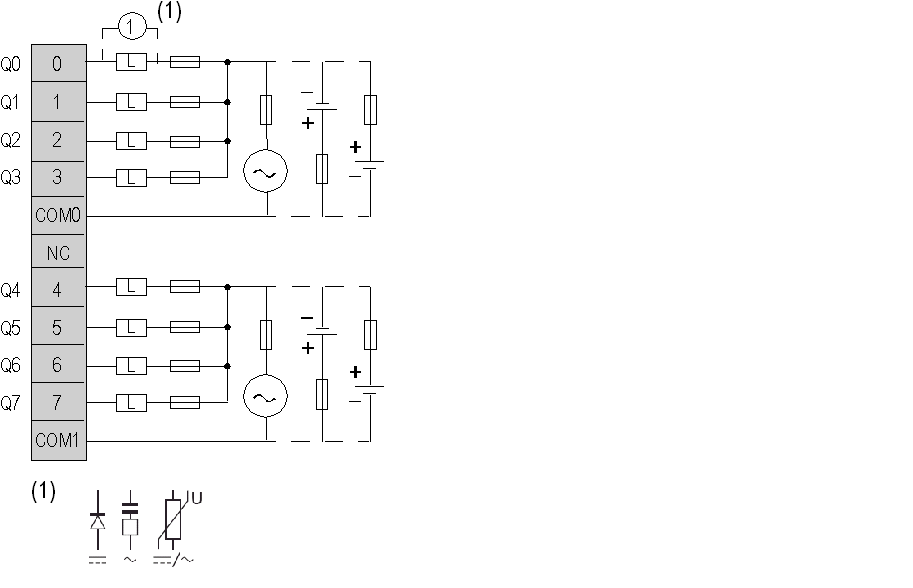

# Connecting the TM2DRA8RT Module

Connecting the TM2DRA8RT Module

Introduction

TM2DRA8RT is a 8-channel, relay output module.

This module is fitted with a removable connection screw terminal block for the connection of outputs.

Wiring Rules

See [Wiring Requirements](../Modules_General_Overview/Modules_General_Overview-12.htm#XREF_D_RU_0004606_1).

TM2DRA8RT Wiring Diagram

The following diagram shows the connection of the outputs and [the relay output wiring](../Modules_General_Overview/Modules_General_Overview-12.htm#XREF_D_RU_0004606_13).

oThe COM0 and COM1 terminals are not connected together internally.

oConnect a fuse for the load, not to exceed 7 A.

o(1) is the protection for inductive load.

|  |
| --- |
| Warning_Color.gifWARNING |
| UNINTENDED EQUIPMENT OPERATION |
| Do not connect wires to unused terminals and/or terminals indicated as “No Connection (N.C.)”. |
| Failure to follow these instructions can result in death, serious injury, or equipment damage. |

EIO0000000028.08

© 2020 Schneider Electric. All rights reserved.