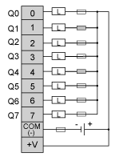

# Connecting the TM2DDO8UT Module

Connecting the TM2DDO8UT Module

Introduction

TM2DDO8UT is a 8-channel, transistor output module.

This module is fitted with a removable connection screw terminal block for the connection of outputs.

Wiring Rules

See [Wiring Requirements](../Modules_General_Overview/Modules_General_Overview-12.htm#XREF_D_RU_0004606_1).

TM2DDO8UT Wiring Diagram

The following diagram shows the connection of the outputs module (on the left) and the [transistor output wiring](../Modules_General_Overview/Modules_General_Overview-12.htm#XREF_D_RU_0004606_13) (on the right).

Connect an appropriate fuse for load.

|  |
| --- |
| Warning_Color.gifWARNING |
| UNINTENDED EQUIPMENT OPERATION |
| Do not connect wires to unused terminals and/or terminals indicated as “No Connection (N.C.)”. |
| Failure to follow these instructions can result in death, serious injury, or equipment damage. |

EIO0000000028.08

© 2020 Schneider Electric. All rights reserved.