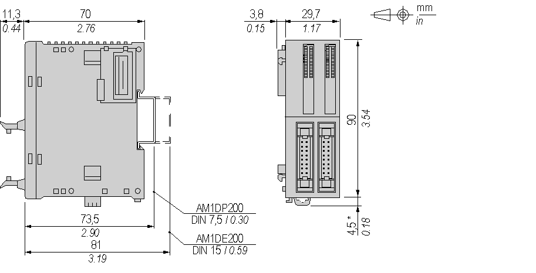

# Characteristics of the TM2DDO32UK Module

Characteristics of the TM2DDO32UK Module

Introduction

This section provides a description of the power limitation, the electrical and the output character­istics of the TM2DDO32UK module.

See also [Environmental Characteristics](../TM2_Discrete_I_O_Presentation_all_Modules/TM2_Discrete_I_O_Presentation_all_Modules.htm#XREF_D_RU_0004605_1).

|  |
| --- |
| Danger_Color.gifDANGER |
| FIRE HAZARD |
| Use only the correct wire sizes for the maximum current capacity of the I/O channels and power supplies. |
| Failure to follow these instructions will result in death or serious injury. |

|  |
| --- |
| Warning_Color.gifWARNING |
| UNINTENDED EQUIPMENT OPERATION |
| Do not exceed any of the rated values specified in the environmental and electrical characteristics tables. |
| Failure to follow these instructions can result in death, serious injury, or equipment damage. |

Dimensions

The following diagrams show the dimensions for the TM2DDO32UK module.

NOTE: \* 8.5 mm (0.33 in) when the clamp is pulled out.

TM2DDO32UK Electrical Characteristics

|  |  |
| --- | --- |
| Isolation between output internal bus | 500 Vac |
| Isolation between output terminal | Not isolated |
| Connector insertion/removal durability | Over 100 times |
| Current draw on 5 Vdc internal bus | 20 mA (all outputs on)  10 mA (all outputs off) |
| Current draw on 24 Vdc internal bus | 70 mA (all outputs on)  0 mA (all outputs off) |

TM2DDO32UK Output Characteristics

|  |  |
| --- | --- |
| Output channels | 32 |
| Common lines | 1 common line for 16 channels |
| Output current | 0.12 A max per output |
| 2 A max per common line |
| Output voltage | 24 Vdc |
| Output voltage range | 20.4...28.8 Vdc |
| Voltage drop | 0.4 Vdc max |
| Turn on time | 300 µs |
| Turn off time | 300 µs |
| Protection against overload and short circuit | External fuse (fast blow, 0.125 A Max) |
| Protection against reverse polarity | Not protected |

EIO0000000028.08

© 2020 Schneider Electric. All rights reserved.