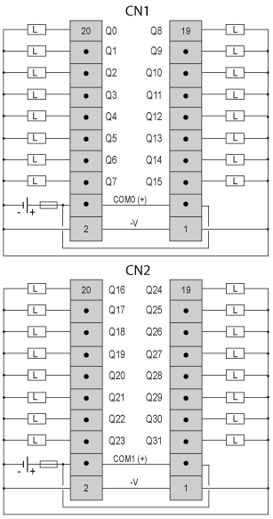

# Connecting the TM2DDO32TK Module

Connecting the TM2DDO32TK Module

Introduction

TM2DDO32TK is a 32-channel, transistor output module.

This module is fitted with an HE10 connector for the connection of outputs.

Wiring Rules

See [Wiring Requirements](../Modules_General_Overview/Modules_General_Overview-12.htm#XREF_D_RU_0004606_1).

TM2DDO32TK Wiring Diagram

The following diagram shows the connection of the outputs module and the [transistor output wiring](../Modules_General_Overview/Modules_General_Overview-12.htm#XREF_D_RU_0004606_13).

oTerminals CN1 and CN2 are not connected together internally.

oThe COM0(+) terminals are connected together internally.

oThe COM1(+) terminals are connected together internally.

oThe -V terminals are connected together internally.

oConnect an appropriate fuse for the load, not to exceed 0.4 A on the outputs and 2 A on the power supply.

|  |
| --- |
| Warning_Color.gifWARNING |
| UNINTENDED EQUIPMENT OPERATION |
| Do not connect wires to unused terminals and/or terminals indicated as “No Connection (N.C.)”. |
| Failure to follow these instructions can result in death, serious injury, or equipment damage. |

EIO0000000028.08

© 2020 Schneider Electric. All rights reserved.