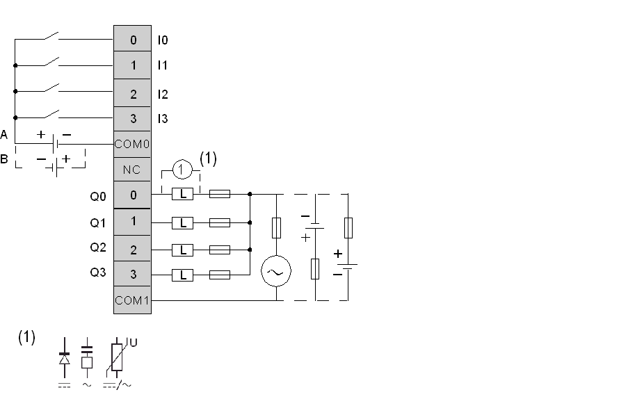

# Connecting the TM2DMM8DRT Module

Connecting the TM2DMM8DRT Module

Introduction

TM2DMM8DRT is a 4-channel input/4-channel output, mixed I/O module.

This module is fitted with a removable connection screw terminal block for the connection of inputs, outputs and power supply.

Wiring Rules

See [Wiring Requirements](../Modules_General_Overview/Modules_General_Overview-12.htm#XREF_D_RU_0004606_1).

TM2DMM8DRT Wiring Diagram

The following diagram shows the connection of the inputs module to the sensors (on the left) and the connection of the outputs with [the relay output wiring](../Modules_General_Overview/Modules_General_Overview-12.htm#XREF_D_RU_0004606_13) (on the right).

oThe COM0 and COM1 terminals are not connected together internally.

oBoth sink and source input wiring are supported

oA is the sink wiring (positive logic).

oB is the source wiring (negative logic).

oConnect an appropriate fuse for the load, not to exceed 2 A on the outputs and 7 A on the output power supply.

o(1) is the protection for inductive load.

|  |
| --- |
| Warning_Color.gifWARNING |
| UNINTENDED EQUIPMENT OPERATION |
| Do not connect wires to unused terminals and/or terminals indicated as “No Connection (N.C.)”. |
| Failure to follow these instructions can result in death, serious injury, or equipment damage. |

EIO0000000028.08

© 2020 Schneider Electric. All rights reserved.