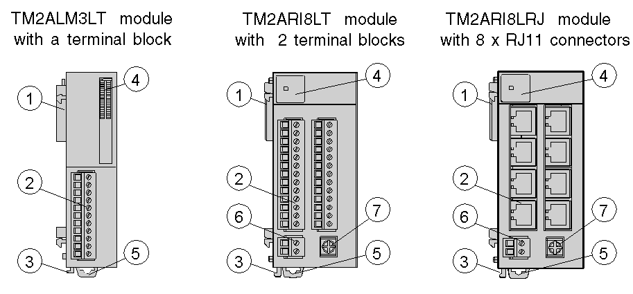

# Introduction

Introduction

This section describes the parts of Analog I/O modules, two with terminal block and one with 8 x RJ11 connectors. Your I/O module may differ from the illustrations but the parts will be the same.

