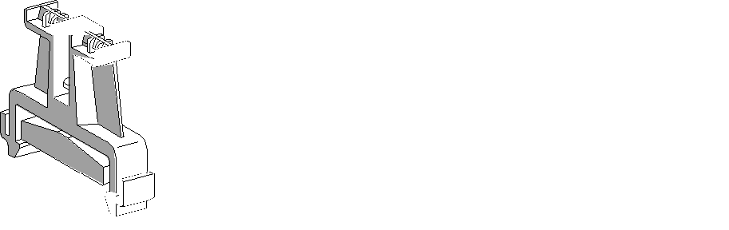

# Terminal Block End Clamp Type AB1AB8P35

Terminal Block End Clamp Type AB1AB8P35

Terminal Block End Clamps (reference AB1AB8P35) help reduce side-to-side movement of your controller and modules on the mounting rail. A controller and its associated modules are mounted on the mounting rail between two end clamps in order to improve the shock and vibration characteristics of the assembly.

The following picture shows a AB1AB8P35 Terminal Block End Clamp:

