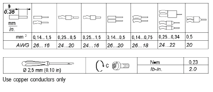

# Wiring Guidelines

Wiring Guidelines

|  |
| --- |
| DangerElectrical_Color.gifDanger_Color.gifDANGER |
| HAZARD OF ELECTRIC SHOCK, EXPLOSION OR ARC FLASH |
| oDisconnect all power from all equipment including connected devices prior to removing any covers or doors, or installing or removing any accessories, hardware, cables, or wires except under the specific conditions specified in the appropriate hardware guide for this equipment.  oAlways use a properly rated voltage sensing device to confirm the power is off where and when indicated.  oReplace and secure all covers, accessories, hardware, cables, and wires and confirm that a proper ground connection exists before applying power to the unit.  oUse only the specified voltage when operating this equipment and any associated products. |
| Failure to follow these instructions will result in death or serious injury. |

The following rules must be applied when wiring the analog I/O modules:

oI/O and communication wiring must be kept separate from the power wiring. Route these 2 types of wiring in separate cable ducting.

oVerify that the operating conditions and environment are within the specification values.

oUse proper wire sizes to meet voltage and current requirements.

oUse copper conductors only.

oUse twisted-pair, shielded cables for analog, expert and/or fast I/O.

oUse twisted-pair, shielded cables for networks and field bus (CANopen, serial, Ethernet).

|  |
| --- |
| Warning_Color.gifWARNING |
| UNINTENDED EQUIPMENT OPERATION |
| oUse shielded cables for all input, output and communication types specified above.  oProperly ground the cable shields as indicated in the related documentation.  oRoute communications and I/O cables separately from power cables. |
| Failure to follow these instructions can result in death, serious injury, or equipment damage. |

For more details, refer to [Grounding](Modules_General_Overview-13.htm#XREF_D_AN_0000673_1).

The following table shows the cable types and wire sizes for removable screw terminal block:

Applying torque above the limit specified may damage the terminal screw or threads.

|  |
| --- |
| NOTICE |
| INOPERABLE EQUIPMENT |
| Do not tighten screw terminals beyond the specified maximum torque (Nm / lb-in.). |
| Failure to follow these instructions can result in equipment damage. |