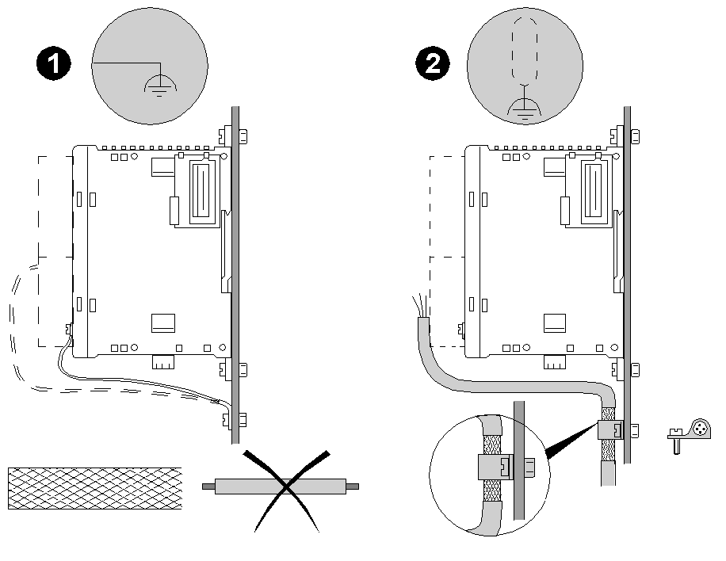

# Presentation

Presentation

Electromagnetic radiation may interfere with control communications and/or input/ouput signals to the control system.

Use shielded, properly grounded cables for all analog and high-speed inputs or outputs and communication connections. If you do not use shielded cable for these connections, electromagnetic interference can cause signal degradation. Degraded signals can cause the controller or attached modules and equipment to perform in an unintended manner.

|  |
| --- |
| Warning_Color.gifWARNING |
| UNINTENDED EQUIPMENT OPERATION |
| oUse shielded cables for all fast I/O, analog I/O and communication signals.  oGround cable shields for all analog I/O, fast I/O and communication signals at a single point1.  oRoute communication and I/O cables separately from power cables. |
| Failure to follow these instructions can result in death, serious injury, or equipment damage. |

1Multipoint grounding is permissible if connections are made to an equipotential ground plane dimensioned to help avoid cable shield damage in the event of power system short-circuit currents.

|  |
| --- |
| Warning_Color.gifWARNING |
| INACCURATE ANALOG CONVERSIONS |
| Make sure that an appropriate, braided ground cable is attached to the ground terminal of the module and securely attached to the protective ground connection of your system. |
| Failure to follow these instructions can result in death, serious injury, or equipment damage. |

| N° | Signification | Description |
| --- | --- | --- |
| 1 | Grounding of the module | Connect the module to the functional ground (FE) terminal with the braided cable supplied with the module. |
| 2 | Grounding of the sensor | Attach and ground the shielding of cables as close as possible to the controller base:  oStrip the shielding  oAttach the cable to the metal support by attaching the clamp to the stripped part of the shielding.  The shielding must be clamped tightly enough to the metal support to permit good contact. |