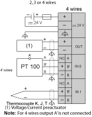

# TM2ALM3LT Wiring Diagram

TM2ALM3LT Wiring Diagram

To use the braid supplied with the module to connect the functional ground.

oConnect an appropriate fuse for the applied voltage and current draw, at the position shown in the diagram.

oWhen connecting an PT100 temperature probe, connect the wires to terminals A, B’, and B of input channel 0 or 1.

oWhen connecting a thermocouple, connect the two wires to terminals B’ and B of input channel 0 or 1.

|  |
| --- |
| Danger_Color.gifDANGER |
| FIRE HAZARD |
| Use only the correct wire sizes for the maximum current capacity of the I/O channels and power supplies. |
| Failure to follow these instructions will result in death or serious injury. |

Use shielded, properly grounded cables for all analog and high-speed inputs or outputs and communication connections. If you do not use shielded cable for these connections, electromagnetic interference can cause signal degradation. Degraded signals can cause the controller or attached modules and equipment to perform in an unintended manner.

|  |
| --- |
| Warning_Color.gifWARNING |
| UNINTENDED EQUIPMENT OPERATION |
| oUse shielded cables for all fast I/O, analog I/O and communication signals.  oGround cable shields for all analog I/O, fast I/O and communication signals at a single point1.  oRoute communication and I/O cables separately from power cables. |
| Failure to follow these instructions can result in death, serious injury, or equipment damage. |

1Multipoint grounding is permissible if connections are made to an equipotential ground plane dimensioned to help avoid cable shield damage in the event of power system short-circuit currents.

|  |
| --- |
| Warning_Color.gifWARNING |
| UNINTENDED EQUIPMENT OPERATION |
| Do not connect wires to unused terminals and/or terminals indicated as “No Connection (N.C.)”. |
| Failure to follow these instructions can result in death, serious injury, or equipment damage. |

NOTE: To help avoid interference of the analog signals, the power supply of the module must be turned on or off at the same time than the base controller power supply.

|  |
| --- |
| Warning_Color.gifWARNING |
| UNINTENDED EQUIPMENT OPERATION |
| Turn the power supplies for the module and the associated controller on and off at the same time. |
| Failure to follow these instructions can result in death, serious injury, or equipment damage. |