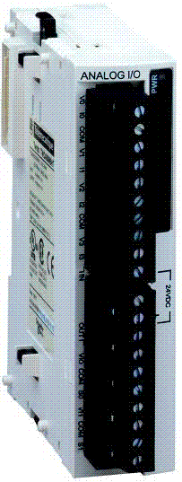

# TM2 Analog I/O Modules - Hardware Guide

TM2 Analog I/O Modules - Hardware Guide

TM2 Analog I/O Expansion Modules - Hardware Guide

This guide describes the hardware implementation of TM2 Analog I/O Modules. It provides parts descriptions, characteristics, wiring diagrams, installation, and setup for TM2 Analog I/O modules.

EIO0000000034.11

© 2020 Schneider Electric. All rights reserved.