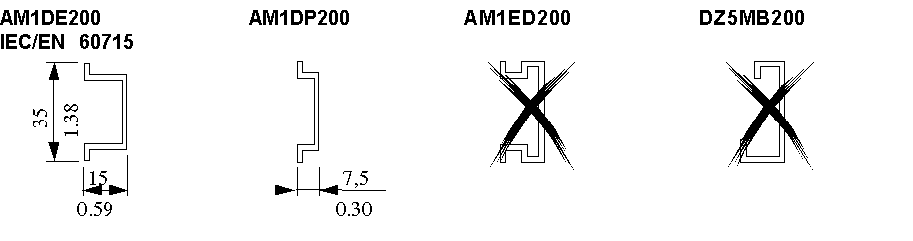
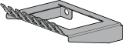

# Accessories

Accessories

Terminal Block End Clamp Type AB1AB8P35

Terminal Block End Clamps (reference AB1AB8P35) help reduce side-to-side movement of your controller and modules on the mounting rail. A controller and its associated modules are mounted on the mounting rail between two end clamps in order to improve the shock and vibration characteristics of the assembly.

The following picture shows a AB1AB8P35 Terminal Block End Clamp:

The Mounting Rail

 You can mount the controller and its expansion modules on a mounting rail. A mounting rail can be attached to a smooth mounting surface or suspended from an Electronic Industries Alliance (EIA) rack or in a Type 4 cabinet.

The following picture shows the different sizes of the mounting rail:

You can order the suitable mounting rail from Schneider Electric:

| Rail depth | Catalogue part number |
| --- | --- |
| 15 mm (0.59 in.) | AM1DE200 |
| 7,5 mm (0.30 in.) | AM1DP200 |

NOTE: Do not use AM1ED200 and DZ5MB200.

TWDXMT5 Panel Mount Kit

 The following illustration shows a TWDXMT5 Panel Mount Kit which can be used instead of a mounting rail to mount your controller and I/O modules directly to a panel:

TM2XMTGB Grounding Bar

The TM2XMTGB Grounding Bar is used to connect the shields of the cables and the functional ground of the modules to [ground](Modules_General_Overview-13.htm#XREF_D_AN_0000673_1).

EIO0000000034.11

© 2020 Schneider Electric. All rights reserved.