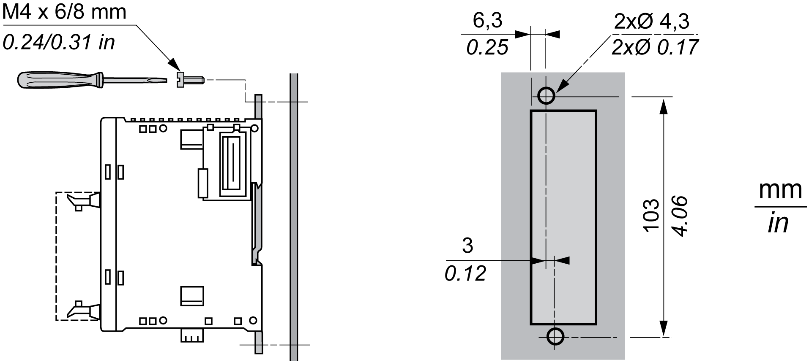

# Mounting a Module Directly on a Panel Surface

Mounting a Module Directly on a Panel Surface

Overview

This section shows how to install your module using the Panel Mounting Kit. This section also provides mounting hole layout for all modules. Your module may differ from the module appearing in these illustrations but the procedure is still applicable.

Installing the Panel Mount Kit

The following procedure shows how to install a mounting strip.

| Step | Action |
| --- | --- |
| 1 | Remove the clip-on-lock from the back side of the module by pushing the clip-on lock upwards. |
| 2 | Insert the mounting strip, with the hook entering last, into the slot where the clip-on lock was removed. |
| 3 | Slide the mounting strip into the slot until the hook enters into the recess in the module. |

The following illustration shows how to attach the TWDXMT5 Panel Mount Kit to a module:

Mounting Hole Layout for Modules

The following diagram shows the mounting hole layout for all modules:

EIO0000000034.11

© 2020 Schneider Electric. All rights reserved.