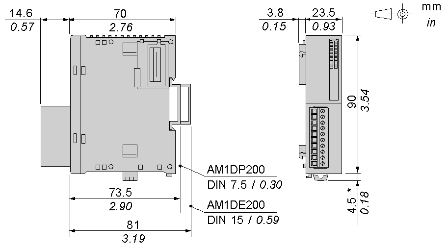

# Characteristics of the TM2AMI2LT Module

Characteristics of the TM2AMI2LT Module

Introduction

This section provides a description of the electrical and the input characteristics of the TM2AMI2LT module.

|  |
| --- |
| Danger_Color.gifDANGER |
| FIRE HAZARD |
| Use only the correct wire sizes for the maximum current capacity of the I/O channels and power supplies. |
| Failure to follow these instructions will result in death or serious injury. |

|  |
| --- |
| Warning_Color.gifWARNING |
| UNINTENDED EQUIPMENT OPERATION |
| Do not exceed any of the rated values specified in the environmental and electrical characteristics tables. |
| Failure to follow these instructions can result in death, serious injury, or equipment damage. |

Dimensions

The following diagrams show the dimensions for the TM2AMI2LT analog input module.

NOTE: \* 8.5 mm (0.33 in) when the clip-on lock is pulled out.

TM2AMI2LT General Characteristics

|  |  |
| --- | --- |
| Rated power supply voltage | 24 Vdc |
| Power supply range | 20.4...28.8 Vdc |
| Connector insertion/removal durability | 100 times minimum |
| Internal 5 Vdc current draw | 60 mA |
| Internal 24 Vdc current draw | 0 mA |
| External 24 Vdc current draw | 21 mA (inrush, 30 mA) |
| Weight | 85 g (3 oz) |

TM2AMI2LT Input Characteristics

|  |  |
| --- | --- |
| Input range | Type K: -270...+1370 °C (-454...+2498 °F)  Type J: -200...+760 °C (-328...+1400 °F)  Type T: -270...+400 °C (-454...+752°F) |
| Input impedance | 1 MΩ min. |
| Sample duration time | 200 ms |
| Total input system transfer time | 400 ms + 1 scan time |
| Input type | Differential input |
| Operating mode | Self-scan |
| Conversion mode | ΣΔ ADC 16 bits |
| Maximum overload on input channel | ±7.5 Vdc |
| Input tolerance - maximum deviation at 25°C (77°F) | 0.2 % + temperature correction total error  K, J,T: ±5 °C |
| Input tolerance - temperature drift | ±0.006 % of full scale/°C |
| Input tolerance - repeatable after stabilization time | ±0.5 % of full scale |
| Input tolerance - nonlinear | ±0.2 % of full scale |
| Input tolerance- maximum deviation | ±1 % of full scale |
| Resolution | Type T: 13 bits  Type J, K: 14 bits |
| Input value of LSB | 0.1 °C (0.18 °F) |
| Data type in application program | 0 to 4095  Scalable to -32768 to 32767 |
| Temperature Setting | Celsius (factory default setting)  Fahrenheit (user-configurable) |
| Input data out of range detection | Yes1 |
| Noise resistance - maximum temporary deviation during perturbations | ±1 % maximum |
| Noise resistance - cable | Twisted-pair shielded cable is necessary |
| Noise resistance - crosstalk | 2 LSB maximum |
| Isolation between inputs | None |
| Isolation between inputs and logic circuits | Photocoupler between input and internal circuit (2500 Vac) |
| Isolation between external power supply and inputs | 500 Vac |
| Selection of analog input signal type | Using SoMachine |
| Calibration or verification to maintain rated accuracy | Approximately 10 years |
| 50/60 Hz rejection and filtering | 50/60 Hz:  120 dB rejection typ. (common mode)  60 dB rejection typ. (differential mode)  Numeric filtering function by firmware |
| Temperature drift | 30 ppm/°C |
| Cold junction compensation | Internal temperature sensor |
| Default input value in case of sensor disconnection | Ambient temperature of the module |

NOTE:

1.Total input system transfer time = sample repetition x active channel number + 1 scan time.

EIO0000000034.11

© 2020 Schneider Electric. All rights reserved.