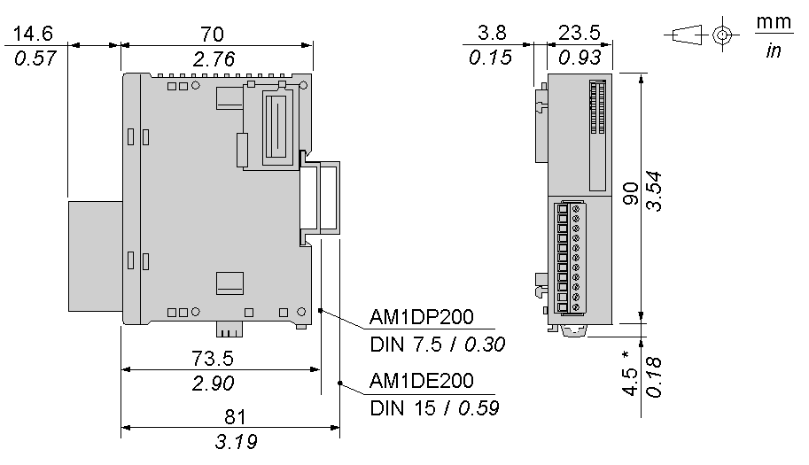

# Characteristics of the TM2ARI8HT Module

Characteristics of the TM2ARI8HT Module

Introduction

This section provides a description of the electrical and the input characteristics of the TM2ARI8HT module.

|  |
| --- |
| Danger_Color.gifDANGER |
| FIRE HAZARD |
| Use only the correct wire sizes for the maximum current capacity of the I/O channels and power supplies. |
| Failure to follow these instructions will result in death or serious injury. |

|  |
| --- |
| Warning_Color.gifWARNING |
| UNINTENDED EQUIPMENT OPERATION |
| Do not exceed any of the rated values specified in the environmental and electrical characteristics tables. |
| Failure to follow these instructions can result in death, serious injury, or equipment damage. |

Dimensions

The following diagrams show the dimensions for the TM2ARI8HT analog input module.

NOTE: \* 8.5 mm (0.33 in) when the clip-on lock is pulled out.

TM2ARI8HT General Characteristics

|  |  |
| --- | --- |
| Rated power supply voltage | 24 Vdc |
| Power supply range | 19.2...30 Vdc including ripple |
| Connector insertion/removal durability | 100 times minimum |
| Internal 5 Vdc current draw | 50 mA |
| Internal 24 Vdc current draw | 0 mA |
| External 24 Vdc current draw | 45 mA |
| Weight | 85 g (3 oz) |

TM2ARI8HT Input Characteristics

|  |  |
| --- | --- |
| Input range | NTC or PTC thermistor  Resistance range: 100 Ω...10 kΩ |
| Input impedance | 1 MΩ min. |
| Sample duration time | 160 ms |
| Total input system transfer time | 8x160 ms + 1 scan time |
| Input type | Nondifferential |
| Operating mode | Self-scan |
| Conversion mode | ΣΔ type ADC |
| Input tolerance - maximum deviation at 25°C (77°F) | ±0.2 % of full scale |
| Input tolerance - temperature drift | ±0.01 % of full scale/°C |
| Input tolerance - repeatable after stabilization time | ±0.4% of full scale |
| Input tolerance - nonlinear | ±0.002 % of full scale |
| Input tolerance - maximum deviation | ±1 % of full scale |
| Resolution | 10 bits (1024 increments) |
| Input value of LSB | Depending on the probe |
| Data type in application program | 0 to 1023  Scalable to -32768 to 32767 |
| Input data out of range detection | Yes1 |
| Noise resistance - maximum temporary deviation during perturbations | ±1 % of full scale |
| Noise resistance - cable | Twisted-pair shielded cable is necessary |
| Noise resistance - crosstalk | 1 LSB maximum |
| Isolation between power supply and inputs | None |
| Isolation between inputs | None |
| Isolation between power supply, inputs and internal logic circuits | Photocoupler between input and internal circuit (2500 Vac) |
| Calibration or verification to maintain rated accuracy | Approximately 10 years |

NOTE:

1.Total input system transfer time = sample repetition x 2 + 1 scan time.

EIO0000000034.11

© 2020 Schneider Electric. All rights reserved.