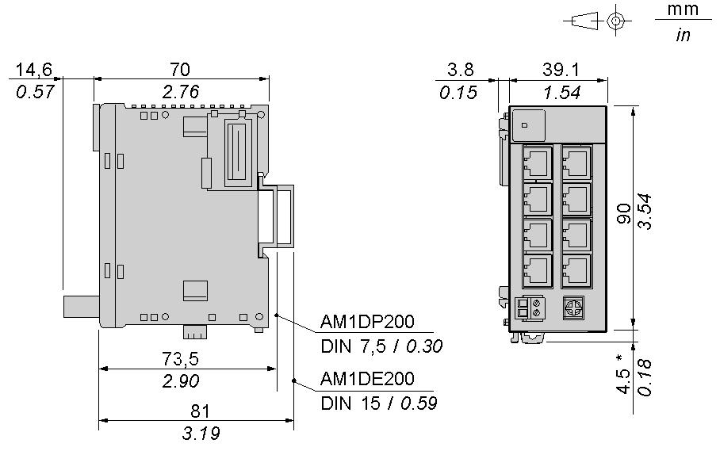

# Characteristics of the TM2ARI8LRJ Module

Characteristics of the TM2ARI8LRJ Module

Introduction

This section provides a description of the electrical and the input characteristics of the TM2ARI8LRJ module.

|  |
| --- |
| Danger_Color.gifDANGER |
| FIRE HAZARD |
| Use only the correct wire sizes for the maximum current capacity of the I/O channels and power supplies. |
| Failure to follow these instructions will result in death or serious injury. |

|  |
| --- |
| Warning_Color.gifWARNING |
| UNINTENDED EQUIPMENT OPERATION |
| Do not exceed any of the rated values specified in the environmental and electrical characteristics tables. |
| Failure to follow these instructions can result in death, serious injury, or equipment damage. |

Dimensions

The following diagrams show the dimensions for the TM2ARI8LRJ analog input module.

NOTE: \* 8.5 mm (0.33 in) when the clip-on lock is pulled out.

TM2ARI8LRJ General Characteristics

|  |  |
| --- | --- |
| Rated power supply voltage | 24 Vdc |
| Power supply range | 19.2...30 Vdc including ripple |
| RJ11 connector | 50 times minimum |
| Power supply connector | 50 times minimum |
| Connector insertion/removal durability | 100 times minimum |
| Internal 5 Vdc current draw | 90 mA |
| Internal 24 Vdc current draw | 0 mA |
| External 24 Vdc current draw | 140 mA |
| Weight | 118 g (4.17 oz) |

TM2ARI8LRJ Input Characteristics

|  |  |
| --- | --- |
| Input range | PT1000: -50...200°C (-58...392°F)  PT100: -200...600°C (-328...1112°F) |
| Input impedance | > 10 kΩ |
| Sample duration time | 320 ms per channel |
| Total input system transfer time | 4 x 320 ms + 1 scan time |
| Input type | Nondifferential |
| Operating mode | Self-scan |
| Conversion mode | ΣΔ type ADC |
| Input tolerance - maximum deviation at ambient 25°C (77°F) | PT1000: ± 0.5 °C ( 0.9 °F)  PT100: ± 1.5 °C ( 2.7 °F)  Range -50 °C (-58 °F) to 200 °C (392 °F): ±1 °C (33.8 °F)  Range -200 °C (392 °F) to 600 °C (1112 °F): +0.1% / -0.5% full scale |
| Input tolerance- temperature drift | ± 0.5 °C ( 0.9 °F) |
| Input deviation- repeatable after stabilization time | ± 0.1°C( 32.18 °F) |
| Resolution | 12 bits (4096 increments) |
| Input value of LSB | PT1000: ±1°C ( 33.8 °F)  PT100: +1°C / -4°C ( 33.8 °F / 24.8 °F) |
| Total maximum deviation | PT1000: 0.06°C ( 0.108 °F)  PT100: 0.2°C ( 0.36 °F) |
| Data type in application program | 0 to 4095  Scalable to -32768 to 32767 |
| Input data out of range detection | Yes (1) |
| Broken wire detection | Yes (1) |
| Noise resistance - maximum temporary deviation during perturbations | ±1 % of full scale |
| Cable resistance compensation | 100 Ω max |
| Noise resistance - crosstalk | 1 LSB maximum |
| Isolation between inputs | None |
| Isolation between inputs, power supply and internal logic circuits | Photocoupler between input and internal circuit (2500 Vac) |
| Isolation between inputs and external power supply | 500 Vac |
| Dielectric strength | - 1500 Vrms between inputs and internal bus  - 500 Vrms between inputs and 0V  - 1500 Vrms between internal bus and 0V |
| Type of protection with terminal bus | Photocoupler between input and internal circuit: 1500 Vac isolation |
| Selection of analog input signal type | Choose PT100 and PT1000 using programming software |
| Default input value in case of temperature sensor disconnection | Upper limit |

NOTE:

1.Total input system transfer time = sample repetition x 2 + 1 scan time.

EIO0000000034.11

© 2020 Schneider Electric. All rights reserved.