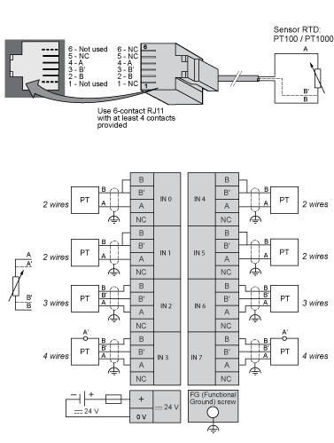
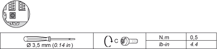

# Connecting the TM2ARI8LRJ Module

Connecting the TM2ARI8LRJ Module

Wiring Requirements

See [Wiring Requirements](../Modules_General_Overview/Modules_General_Overview-12.htm#XREF_D_AN_0000669_1).

TM2ARI8LRJ Wiring Diagram

The following diagram shows the connection of the module inputs.

oUse RJ11 6-pin connectors with a minimum of 4 pins.

oConnect an appropriate fuse for the applied voltage and current draw, at the position shown in the diagram.

oFor the functional ground screw, use a screw-driver with a diameter of 3.5 mm (0.14 in) and apply a torque of 0.5 Nm (4.4 lb-in).

Use shielded, properly grounded cables for all analog and high-speed inputs or outputs and communication connections. If you do not use shielded cable for these connections, electromagnetic interference can cause signal degradation. Degraded signals can cause the controller or attached modules and equipment to perform in an unintended manner.

|  |
| --- |
| Warning_Color.gifWARNING |
| UNINTENDED EQUIPMENT OPERATION |
| oUse shielded cables for all fast I/O, analog I/O and communication signals.  oGround cable shields for all analog I/O, fast I/O and communication signals at a single point1.  oRoute communication and I/O cables separately from power cables. |
| Failure to follow these instructions can result in death, serious injury, or equipment damage. |

1Multipoint grounding is permissible if connections are made to an equipotential ground plane dimensioned to help avoid cable shield damage in the event of power system short-circuit currents.

|  |
| --- |
| Warning_Color.gifWARNING |
| UNINTENDED EQUIPMENT OPERATION |
| Do not connect wires to unused terminals and/or terminals indicated as “No Connection (N.C.)”. |
| Failure to follow these instructions can result in death, serious injury, or equipment damage. |

The following table shows the characteristics of the functional ground connection:

EIO0000000034.11

© 2020 Schneider Electric. All rights reserved.