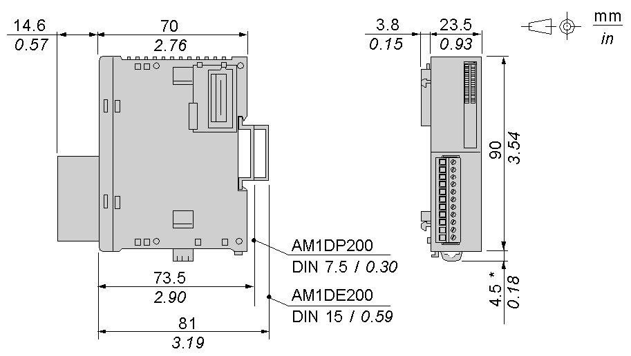

# Characteristics of the TM2AMO1HT Module

Characteristics of the TM2AMO1HT Module

Introduction

This section provides a description of the electrical and the output characteristics of the TM2AMO1HT module.

|  |
| --- |
| Danger_Color.gifDANGER |
| FIRE HAZARD |
| Use only the correct wire sizes for the maximum current capacity of the I/O channels and power supplies. |
| Failure to follow these instructions will result in death or serious injury. |

|  |
| --- |
| Warning_Color.gifWARNING |
| UNINTENDED EQUIPMENT OPERATION |
| Do not exceed any of the rated values specified in the environmental and electrical characteristics tables. |
| Failure to follow these instructions can result in death, serious injury, or equipment damage. |

Dimensions

The following diagrams show the dimensions for the TM2AMO1HT analog output module.

NOTE: \* 8.5 mm (0.33 in) when the clip-on lock is pulled out.

TM2AMO1HT General Characteristics

|  |  |
| --- | --- |
| Rated power supply voltage | 24 Vdc |
| Power supply range | 19.2...30 Vdc including ripple |
| Connector insertion/removal durability | 100 times minimum |
| Internal 5 Vdc current draw | 50 mA |
| Internal 24 Vdc current draw | 0 mA) |
| External 24 Vdc current draw | 40 mA |
| Weight | 85 g (3 oz) |

TM2AMO1HT Output Characteristics

| Characteristic | Voltage output | Current output |
| --- | --- | --- |
| Output range | 0...10 Vdc | 4...20 mA |
| Load impedance | 2 kΩ minimum | 300 Ω maximum |
| Application load type | Resistive load | |
| Settling time | 10 ms | |
| Total output system transfer Time | 10 ms + 1 scan time | |
| Output tolerance - maximum deviation at 25°C (77°F) | ±0.2% of full scale | |
| Output tolerance - temperature drift | ±0.015% of full scale/°C | |
| Output tolerance - repeatable after stabilization time | ±0.5 % of full scale | |
| Output tolerance - output voltage drop | ±1% of full scale | |
| Output tolerance - nonlinear | ±0.2% of full scale | |
| Output tolerance - output ripple | 1 LSB maximum | |
| Output tolerance - overshoot | 0% | |
| Output tolerance - total deviation | ±1 % of full scale | |
| Resolution | 12 bits (4096 increments) | |
| Output value of LSB | 2.5 mV | 4.8 μA |
| Data type in application program | 0 to 4095  Scalable to -32768 to 32767 | |
| External power supply connection | Detected1 | Detected1 |
| Noise resistance - cable | Twisted-pair shielded cable is necessary | |
| Isolation between output and external power supply | 500 Vac | |
| Isolation between output and power supply | 500 Vac | |
| Isolation between output, external power supply and internal logic circuits | Photocoupler between output and internal circuit (500 Vac) | |
| Selection of analog output signal type | Using programming software | |
| Calibration or verification to maintain rated accuracy | Approximately 10 years | |

NOTE:

1.When the external 24 Vdc is not connected, a corresponding error code is stored to a data register allocated to analog I/O operating status.

EIO0000000034.11

© 2020 Schneider Electric. All rights reserved.