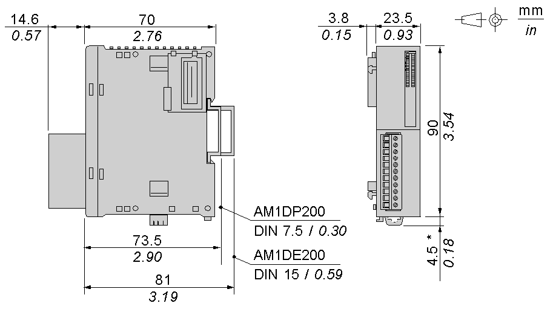

# Characteristics of the TM2AVO2HT Module

Characteristics of the TM2AVO2HT Module

Introduction

This section provides a description of the electrical and the output characteristics of the TM2AVO2HT module.

|  |
| --- |
| Danger_Color.gifDANGER |
| FIRE HAZARD |
| Use only the correct wire sizes for the maximum current capacity of the I/O channels and power supplies. |
| Failure to follow these instructions will result in death or serious injury. |

|  |
| --- |
| Warning_Color.gifWARNING |
| UNINTENDED EQUIPMENT OPERATION |
| Do not exceed any of the rated values specified in the environmental and electrical characteristics tables. |
| Failure to follow these instructions can result in death, serious injury, or equipment damage. |

Dimensions

The following diagrams show the dimensions for the TM2AVO2HT analog output module.

NOTE: \* 8.5 mm (0.33 in) when the clip-on lock is pulled out.

TM2AVO2HT General Characteristics

|  |  |
| --- | --- |
| Rated power supply voltage | 24 Vdc |
| Power supply range | 19.2...30 Vdc including ripple |
| Connector insertion/removal durability | 100 times minimum |
| Internal 5 Vdc current draw | 50 mA |
| Internal 24 Vdc current draw | 0 mA |
| External 24 Vdc current draw | 60 mA |
| Weight | 85 g (3 oz) |

TM2AVO2HT Output Characteristics

| Characteristic | Voltage output |
| --- | --- |
| Output range | ± 10 Vdc |
| Load impedance | 3 kΩ min |
| Application load type | Resistive load |
| Settling time | 2 ms |
| Total output system transfer Time | 2 ms + 1 scan time |
| Output tolerance - maximum deviation at 25°C (77°F) | ±0.5% of full scale |
| Output tolerance - temperature drift | ±0.01% of full scale/°C |
| Output tolerance - repeatable after stabilization time | ±0.1% of full scale |
| Output tolerance - output voltage drop | ±0.5% of full scale |
| Output tolerance - nonlinear | ±0.2% of full scale |
| Output tolerance - output ripple | 1 LSB maximum |
| Output tolerance - overshoot | 0% |
| Output tolerance - total deviation | ±1% of full scale |
| Resolution | 11 bits + sign |
| Output value of LSB | ± 9.8 mV |
| Data type in application program | -2,048 to 2,047  Scalable to -32768 to 327671 |
| Current loop open | Not detectable |
| Noise resistance - maximum temporary deviation during perturbations | ±1% of full scale |
| Noise resistance - cable | Twisted-pair shielded cable is necessary |
| Isolation between outputs | None |
| Isolation between outputs and external power supply | None |
| Isolation between outputs, external power supply and internal logic circuits | Photocoupler between output and internal circuit (2500 Vac) |
| Selection of analog output signal type | Usinge programming softwar |
| Calibration or verification to maintain rated accuracy | Approximately 10 years |

NOTE:

1.The 12-bit data (0 to 4095) processed in the Analog I/O module can be linear-converted to a value between -32768 and 32767. The optional range designation and analog I/O data minimum and maximum values can be selected using data registers allocated to analog I/O modules.

EIO0000000034.11

© 2020 Schneider Electric. All rights reserved.